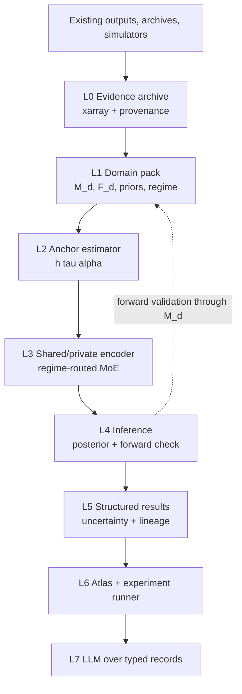
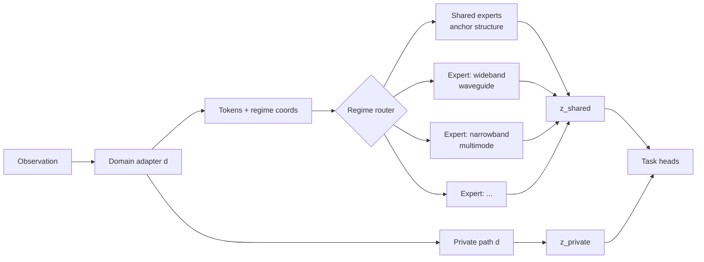

# Crossfade Technical Spec

2026-09-17 · @Someone

Crossfade is a cross-domain inference layer for wave-propagation sensing. It connects sonar, HF skywave radar and RF systems through one physical anchor, the channel spreading function, and it measures where learned structure transfers at matched physical regime instead of assuming it. This draft merges the first-principles plan, the physics-modeling plan and the literature through September 2026 into a spec for review by the sonar lead. Questions where your data and intuition decide the design are collected in the second-to-last section.

## 1. Scope and claims

Crossfade commits to three separable contracts, and the platform stays useful if only the first holds.

| Contract | Claim | Evidence that it holds |
| --- | --- | --- |
| Interoperability | Any wave-sensing system's outputs can be ingested with units, coordinates, processing history and capability level intact, and replayed | A new domain connects through a domain pack without changing the core; a result reproduces from archived evidence |
| Representation transfer | A shared encoder pretrained on one domain reduces target-domain data needed to estimate anchor quantities at matched regime | Frozen-encoder few-shot gain over from-scratch at equal data and compute; zero or negative gain at mismatched regime |
| Evidence fusion | Multiple results about one situation combine without double-counting shared lineage | Fusion layer refuses to treat two views of one recording as independent confirmation |

What Crossfade is not:

- Not a universal physics-informed neural network. PDE-residual PINNs fail at high wavenumber through spectral bias, which is exactly the wave regime here. Physics enters as structural priors on the channel and as forward models in domain packs.
- Not an LLM that reads latent vectors. The LLM sits on typed evidence records, explains, retrieves, and drafts domain packs from expert conversation.
- Not a replacement for existing processing chains. Legacy systems connect through output-only packs with a declared capability level.
- Not a single latent space. Sharing is partial, conditional on regime, and earned by benchmark.

Two tensions in the original conversation are resolved as follows. First, "factor out the channel" versus "the channel is the information": a variable is a nuisance relative to a task, never inherently, so the platform separates source, propagation and instrument contributions and lets each task retain, condition on, or marginalize them. Second, "domain-invariant" versus "no information loss": these cannot both hold in one compressed representation, so the archive preserves the source evidence, the shared representation is task-sufficient, and private pathways carry the rest.

## 2. The anchor: the channel spreading function

The anchor representation is the wideband (delay-scale) spreading function of the propagation channel, with the narrowband delay-Doppler scattering function as its limit. Every domain pack must supply an estimator to it, and cross-domain alignment happens only through it. This is the transcript's own claim, that the time-varying impulse response is the common thread, made literal.

**Narrowband form.** For a linear time-varying channel with input `x(t)` and output `y(t)`, the delay-Doppler spreading function `S_H(τ, ν)` gives

```
y(t) = ∫∫ S_H(τ, ν) x(t − τ) e^{j2πνt} dτ dν
```

Under the WSSUS assumption (Bello 1963) the second-order statistics collapse to the scattering function `C_H(τ, ν) = E|S_H(τ, ν)|²`. Matz and Hlawatsch extend this to non-WSSUS channels with a local scattering function. HF skywave, microwave radar, and most comms live here because `v/c` is of order 1e-6 and Doppler is a pure frequency shift.

**Wideband form.** When `v/c` is of order 1e-3 to 1e-2 and the fractional bandwidth approaches an octave, Doppler is a time dilation, not a shift. The correct description is the delay-scale spreading function `h(τ, α)`:

```
y(t) = ∫∫ h(τ, α) √α · x(α(t − τ)) dτ dα,   α = 1 + v/c
```

Altes (1971) showed the wideband ambiguity function's invariance properties, and the Fourier-Mellin transform is the natural tool because the Mellin transform diagonalizes scale the way Fourier diagonalizes shift. Passive sonar on a maneuvering source lives here.

**Why one anchor works.** The delay-scale form contains the delay-Doppler form as `α → 1` with `ν ≈ (α − 1) f_c`. So the anchor is `h(τ, α)` and each domain pack declares where it sits in `(v/c, B/f_c)`. Whether a given radar task may use the narrowband approximation becomes a derived property of its regime coordinates rather than a hand-written flag.

**Precedent that this is a workable ML target.** CSI-CLIP++ (2026) pretrains an RF channel foundation model by treating frequency-domain channel state information and delay-domain channel impulse response as paired views of one propagation process, aligns them contrastively, and transfers the encoder to identification, beam prediction and positioning, including across simulators. ImageBind (2023) is the general lesson: N modalities need N pairings to one anchor, not N² pairings to each other.

**What the anchor carries.** The shared parameter set `θ_shared` starts with structural descriptors of `h(τ, α)`, all of which have counterparts in every wave domain:

| Descriptor | Sonar meaning | HF skywave meaning |
| --- | --- | --- |
| Delay spread and arrival sparsity | Multipath from surface, bottom, ducts | Multimode from E, F1, F2 layers, ordinary and extraordinary rays |
| Scale or Doppler spread | Source motion, surface scatter | Ionospheric motion, target motion |
| Arrival-structure stability over time | Sound-speed profile drift, internal waves | Traveling ionospheric disturbances |
| Interference structure across frequency | Waveguide-invariant striations | Multimode fading versus frequency |

Domain-specific detail that does not map, such as absolute delay in seconds versus milliseconds, stays in `θ_private` and in the regime coordinates.

## 3. Regime coordinates

A regime is a point in a space of dimensionless groups, not a label like "acoustic" or "RF". Two systems at the same point should share anchor structure regardless of medium; two systems far apart should not, and a model that claims transfer between them is suspect until shown otherwise. This turns "does it transfer?" into a preregisterable hypothesis.

| Group | Definition | Passive sonar, typical | HF skywave, typical | Governs |
| --- | --- | --- | --- | --- |
| `M = v/c` | Radial speed over propagation speed | 1e-3 to 1e-2 | 1e-6 to 1e-5 | Narrowband vs wideband; shift vs scale |
| `β_B = B/f_c` | Fractional bandwidth | 0.3 to 1 | 1e-3 to 1e-2 | Whether Doppler approximation holds; `M · β_B · T · B` is the wideband criterion |
| `Π_τ = τ_spread · B` | Delay spread in resolution cells | 10 to 1000 | 1 to 50 | Arrival resolvability, sparsity prior validity |
| `Π_ν = ν_spread · T` | Doppler or scale spread over observation | 0.1 to 10 | 0.1 to 10 | Coherence, window length, WSSUS validity |
| `Π_L = L/λ` | Aperture in wavelengths | 10 to 100 | 10 to 300 | Angular resolution, mode separability |
| `Π_f = f/f_cutoff` | Frequency over waveguide cutoff | 1 to 50 | 1 to 10 | Number of propagating modes, striation structure |
| `Π_h = h_rms · k · sinθ` | Rayleigh roughness of boundary | 0.1 to 10 | 0.1 to 5 | Coherent vs diffuse boundary scatter |
| `SNR_cell` | Per-resolution-cell SNR | −0 to −20 dB | 0 to 30 dB | Whether estimation is detection-limited |

The transcript's practical question, what FFT length and window for sonar versus HF, is answered in these coordinates. Window length is set by `Π_ν` and resolution by `Π_τ`; once expressed that way it is one decision in both domains.

**How the coordinates are found and used.**

1. Each domain pack declares its nominal ranges for the groups above and any domain-specific groups it adds.
2. IT-π (Yuan and Lozano-Durán, Nature Communications 2025) ranks candidate groups by mutual information with the target quantity and locates regime boundaries from data. It also bounds the minimum achievable error, which gives a model-independent floor for each task.
3. The regime router in the encoder (section 8) is conditioned on these coordinates, so expert assignment can be audited against physics rather than against dataset identity.
4. The atlas (section 10) indexes every validated mapping by the regime box it was tested in.

**Open point.** Sonar sound-speed-profile variability and ionospheric electron-density variability both act as slowly varying multiplicative changes to the propagation operator. Whether a single dimensionless "medium variability rate" (correlation time of the medium over observation time) suffices for both is a question the pilot should answer, not assume.

## 4. Architecture

Eight layers with a stable numerical interface between them. Layers 0, 1, 5 and 6 are the workbench (from plan 2). Layers 2 and 4 and the forward-validation loop are the inference core (from plan 1). Layer 3's specifics and the regime coordinates in layer 1 are the additions from the synthesis.



Each layer's contract, in one line each:

| Layer | Owns | Guarantees | Must never |
| --- | --- | --- | --- |
| L0 Evidence archive | Immutable source artifacts, coordinates, units, masks, lineage | Anything derived can be traced to what was observed | Overwrite or reinterpret an artifact |
| L1 Domain pack | Observation model, forward model or surrogate, structural priors, regime ranges, admissible transforms, tests | Missing capabilities are explicit | Invent a forward model it does not have |
| L2 Anchor estimator | Map from pack evidence to `h(τ, α)` with identifiability assumptions | States what is and is not identifiable from these inputs | Emit a point estimate where the problem is ambiguous |
| L3 Encoder | Shared backbone, routed experts, private residual paths | Sharing is regime-conditioned and auditable | Align whole domains wholesale |
| L4 Inference | Posterior heads, forward validation, alternatives | Every explanation is checked against evidence at the level observed | Compare to an imagined raw signal |
| L5 Results | Quantities, uncertainty with validity scope, evidence graph | A consumer can tell what supports what | Present shared-lineage views as independent |
| L6 Atlas + runner | Scoped mappings, baselines, splits, negative results | Every claim of transfer has a reproducible comparison | Report a gain without a matched baseline |
| L7 LLM | Explanation, retrieval, pack drafting, experiment configuration | Statements reference L5 records | Invent probabilities or declare a mapping valid |

**Interfaces.** L0 to L1 is a typed `Observation` (section 5). L1 to L2 is `Observation + DomainPack`. L2 to L3 is `AnchorEstimate` carrying `h(τ, α)` on a labeled grid, its regime coordinates, and its assumption list. L3 to L4 is `(z_shared, z_private, routing_trace)`. L4 to L5 is `Result`. L6 reads L5 and writes `Mapping` records. L7 reads L5 and L6 and writes only `Explanation` and `PackDraft` records that a person approves.

**Runtime.** A modular Python application with isolated numerical workers, not microservices. Relational store for metadata and lineage; array store for evidence; MLflow or equivalent for model lifecycle, extended with the capability contract in section 6. Batch first, interactive where it earns its place.

## 5. Evidence contract

Six typed objects with explicit semantics. Not a universal ontology and not a tensor shape. A 512-vector is never the interface; named quantities, distributions, assumptions and provenance are.

| Object | Required fields | Notes |
| --- | --- | --- |
| `Observation` | `id`, `source_system`, `acquired_at`, `capability_level`, `data` (labeled array), `coords`, `units`, `masks`, `processing_history[]`, `lineage[]` | The thing actually observed, as observed |
| `Representation` | `id`, `derived_from` (Observation or Representation), `transform` (name, version, params), `coords`, `units`, `components` (complex, magnitude, phase), `info_contract` | What this view retains and drops |
| `AnchorEstimate` | `id`, `derived_from`, `h_tau_alpha` (labeled array), `regime_coords`, `assumptions[]`, `identifiable[]`, `ambiguous[]`, `estimator` (name, version) | Section 7 |
| `Result` | `id`, `question`, `model` (name, version), `quantities{}`, `uncertainty` (meaning, method, validated\_on, in\_scope: bool), `supports[]`, `conflicts[]`, `alternatives[]`, `forward_check` | Section 9 |
| `Mapping` | `id`, `from_domain`, `to_domain`, `semantic_scope`, `task_scope`, `regime_box`, `direction`, `not_preserved[]`, `validation[]`, `verdict` | Section 10 |
| `Review` | `id`, `target`, `kind` (presentation, metadata, adjudication), `scope`, `reviewer`, `evidence` | Only `adjudication` can become a training label, after versioning |

**Capability levels.** Every `Observation` declares one, and downstream components refuse operations the level does not support rather than silently degrading.

| Level | What is available | Supports |
| --- | --- | --- |
| C0 | Upstream summary only (detections, tracks, scalar features) | Retrieval, comparison, evidence fusion |
| C1 | Magnitude-only time-frequency view | Striation-based and envelope-based anchor descriptors; no phase-sensitive estimation |
| C2 | Complex transform coefficients (beam-level STFT, range-Doppler cells) | Coherent anchor estimation within the processed band |
| C3 | Raw element or beam time series with array geometry | Full anchor estimation, blind deconvolution, forward validation |

**Labeled-array schema.** All numerical evidence is an xarray `Dataset` with named dimensions and coordinate variables; anonymous tensors are refused at ingest.

```
Observation.data : xarray.Dataset
  dims    : one of {time}, {time, freq}, {beam, time, freq}, {element, time}, {range, doppler}, ...
  coords  : each dim has a coordinate with units attr; freq carries f_c and B; time carries fs
  attrs   : capability_level, source_system, processing_history (JSON), lineage (JSON list of ids)
  vars    : e.g. p (complex, Pa) | psd (dB re 1 uPa^2/Hz) | iq (complex, V) | rd (dB)
```

**Lineage.** W3C PROV-O vocabulary: entities (objects above), activities (transforms, model runs), agents (systems, people, models). Lineage records derivation only. Independence is a separate judgment made by the fusion layer from the lineage graph: two `Representation`s derived from one `Observation` are never independent confirmation.

**Operational versus research paths.** The operational path ingests C0 to C2 outputs from existing systems and never modifies upstream feature generation. The research path works on C3 archives and simulations. Both share the same objects; only the capability level differs.

## 6. Domain pack specification

A domain pack is a versioned Python package that is the executable description of what the platform knows about one domain. The platform owns execution, evidence and evaluation; the pack owns domain meaning. A pack may ship with limited capability, and what it lacks must be explicit.

| Element | Contents | Required at |
| --- | --- | --- |
| `input_contract` | Accepted `Observation` capability levels, dims, units, required metadata, missing-data behavior | C0 |
| `observation_model` `M_d` | How physical quantities become the available outputs; for legacy chains, a documented approximation or `None` | C1 |
| `forward_model` `F_d` | Solver or learned surrogate mapping `(θ_shared, θ_private, c_d)` to fields; `None` allowed and recorded | C2 |
| `structural_priors` | Arrival sparsity in delay, temporal smoothness, modal phase linearity, boundary-reflection structure, with validity conditions | C1 |
| `regime` | Nominal ranges for section 3 groups plus domain-specific groups; regime estimator from metadata | C0 |
| `anchor_estimators[]` | Classical and learned estimators to `h(τ, α)`, each with `assumptions`, `identifiable`, `ambiguous` | C1 |
| `admissible_transforms` | Convention changes (invariant), coordinate changes (equivariant), physical changes (answer may differ), each with a test | C0 |
| `baselines` | Domain-specific reference models with reproducible configs | C1 |
| `tests` | Held-out evaluations, calibration evidence, known failure cases, regime boundaries where a trick stops working | C1 |
| `vocabulary` | Domain terms mapped to platform quantities, for the LLM layer | C0 |

**Sketch: passive sonar pack (C3).**

- Input: beam or element time series, array geometry, nominal sound-speed profile, bathymetry, `fs`, band.
- `M_d`: beamforming, STFT with declared window, magnitude or complex output; gram normalization documented.
- `F_d`: normal-mode or ray model of the waveguide as forward surrogate; a Fourier-neural-operator surrogate of the parabolic-equation solver is a research option (Frontiers in Marine Science 2025 precedent).
- Priors: sparse ray arrivals with surface and bottom images; modal phase approximately linear in frequency for low-order modes (the assumption behind artificial time reversal); waveguide-invariant striation slope.
- Regime: `M` up to 1e-2, `β_B` up to 1, `Π_f` 1 to 50, `Π_h` boundary roughness declared per site.
- Anchor estimators: ray-based blind deconvolution (Sabra and Dowling), cepstral multipath estimation, wideband ambiguity or Mellin-domain scale estimation, learned estimator trained on the forward model.
- Transforms: `fs` resampling and window choice are convention; array rotation is equivariant; changing the sound-speed profile is physical.

**Sketch: HF skywave pack (C2 or C3).**

- Input: range-Doppler cells or element IQ, waveform parameters, ionosonde or model ionosphere, array geometry.
- `M_d`: matched filter, Doppler processing, CFAR or track outputs; declared coherent-integration time.
- `F_d`: ionospheric ray tracer (discretized-ionosphere ray tracing, 2025) as forward model.
- Priors: few discrete modes with ordinary and extraordinary splitting; slow multiplicative fading from ionospheric motion; mode delay ordering.
- Regime: `M` around 1e-6, `β_B` around 1e-2, narrowband delay-Doppler form applies; `Π_ν` set by ionospheric coherence time.
- Anchor estimators: multimode delay-Doppler estimation from range-Doppler maps; learned CIR reconstruction under interference (physics-informed transformer precedent, 2026).
- Transforms: carrier retune within the band is convention; beam steering is equivariant; ionospheric state change is physical.

**Output-only packs.** A legacy system connects with `M_d = None`, `F_d = None`, `capability_level = C0`, and only `input_contract`, `regime`, `vocabulary` and `tests`. It participates in retrieval and fusion and is excluded from anchor estimation until richer evidence is archived. This is how existing programs join without replacing their processing chains.

## 7. Anchor estimators and identifiability

Every anchor estimator states what it can and cannot recover from its inputs. A learned estimator does not remove an identifiability limit; it hides it. The blind convolution model `y = h * s` has at minimum a scale ambiguity (`h/a`, `a s` gives the same `y`) and, without structure, a whole family of ambiguities. Identifiability and stability require assumptions on signal or filter structure (Li, Lee and Bresler 2015). The domain pack supplies those assumptions; the estimator operates inside them.

**Classical estimators, by capability level.**

| Estimator | Level | Recovers | Assumes | Ambiguous |
| --- | --- | --- | --- | --- |
| Striation slope and waveguide invariant `β` | C1 | Range-rate to range ratio, mode interference structure | Waveguide with a few modes, source broadband | Absolute range without a frequency anchor |
| Cepstral multipath | C1 or C2 | Relative arrival delays, boundary reflection structure | Minimum-phase-ish channel, arrivals separable in quefrency | Arrival ordering when delays overlap |
| Artificial or synthetic time reversal | C3 | Source waveform and source-to-array impulse response | Linear modal phase in frequency, known array geometry and local sound speed | Overall delay and scale |
| Ray-based blind deconvolution | C3 | Impulse response and source waveform, broadband | Resolvable ray arrivals, known array geometry | Source spectrum absolute level |
| Bilinear channel models for sources of opportunity | C3 | Channel from unknown but structured sources | Source lies in a known low-dimensional subspace | Source-channel split within the subspace |
| Wideband ambiguity or Mellin-domain scale estimation | C2 or C3 | Scale `α` and delay `τ` jointly | Known or estimated source waveform, wideband regime | Sign of scale for symmetric spectra |
| Delay-Doppler multimode estimation | C2 | Mode delays and Dopplers | Narrowband regime, few discrete modes | Ordinary-extraordinary assignment |
| Sparse CIR reconstruction under interference | C2 | Full-band CIR from partial spectrum | Sparse arrivals, temporal smoothness | Arrivals within one resolution cell |

**Learned estimators.** Trained on the pack's forward model with the same structural priors as losses (sparsity in delay, smoothness in time, forward consistency through `M_d`), following the physics-informed transformer precedent that reached power-delay-profile similarity 0.82 versus 0.62 for the best baseline at fifty percent spectrum occupancy. A learned estimator inherits the classical estimator's assumption list and must declare its training regime box.

**The overlapping-source problem.** The transcript's Ninja case, many sources superposed in one band with multipath traces that cannot be associated to sources, is blind multichannel source separation. It is not solved by a better encoder. It becomes tractable when the pack supplies the structure that makes it identifiable: a subspace for the sources, the array manifold, and the sparsity of each source's arrival set. The bilinear-model work on sources of opportunity is the acoustic template; the RF analog is a research item for the pilot.

**Estimator output.** An `AnchorEstimate` always carries `h(τ, α)` on a labeled grid, its regime coordinates, and three lists: `assumptions`, `identifiable`, `ambiguous`. A downstream head that needs a quantity in `ambiguous` must return a posterior over the alternatives, not a point.

**What is deliberately not in scope here.** The platform estimates channels and their structure. Detection, classification and tracking heads sit on top of `Result` objects and are owned by each program's existing systems or by later task-specific work.

## 8. Model and training objective

The encoder is a regime-routed mixture-of-experts backbone with private residual pathways, pretrained per domain on unlabeled data and aligned across domains only through the anchor at matched regime. Each component below is individually validated in the literature; their composition is the research claim.

**Why routing rather than a dense shared backbone.** A 2026 benchmark across eight dynamics and twenty-five test regimes found physics foundation models to be conditional generalists, with a substantial fraction of architecture-task pairs showing negative pretraining transfer and larger pretrained models sometimes worse than small baselines. A second 2026 result showed that top-1 routing of latent patches to experts eliminated gradient conflict between incompatible regimes, with held-out tokens routing cleanly by domain while shared experts retained universal structure. Both plans' "partially shared" stance is therefore not caution; it is what the evidence demands.



The router is conditioned on the section 3 regime coordinates, not on the domain id, so expert assignment is auditable against physics. Routing traces are stored with every result.

**The six losses.**

| Loss | Form | Purpose | Precedent |
| --- | --- | --- | --- |
| L1 Masked modeling | Reconstruct masked patches of the domain's native view (IQ or gram) | Label-free pretraining on operational archives | Masked spectrogram modeling for radio (2024); Radio-FM, EMind (2025-26); NEC underwater acoustic model (in progress) |
| L2 Intra-domain multi-view contrastive | InfoNCE among raw signal, time-frequency view and `AnchorEstimate` of the same recording | Makes content shared across views identifiable; the alignment basis | von Kügelgen et al. 2021; Gresele et al. 2020; CSI-CLIP++ 2026 |
| L3 Cross-domain anchor alignment | Contrastive between `z_shared` of records from different domains whose `h(τ, α)` descriptors match, restricted to overlapping regime boxes | Cross-domain sharing where and only where physics says it should exist | Zhao et al. 2019 (why wholesale alignment fails); ImageBind |
| L4 Structural physics | Sparsity of arrivals in `τ`, smoothness of `h` over time, forward consistency `M_d[F_d(θ)] ≈ y` where `F_d` exists | The physics-informed part that actually applies to channels | Zubow et al. 2026; Sabra and Dowling |
| L5 Transformation consistency | Invariance under convention changes, equivariance under coordinate changes, from each pack's `admissible_transforms` | Equivariance, not indiscriminate invariance | Geometric deep learning; plan 1 section 4 |
| L6 Private preservation | Reconstruct domain-native view from `(z_shared, z_private)`; orthogonality penalty between them | Domain detail is retained, not discarded as noise | Domain Separation Networks 2016 |

Task heads add supervised losses only where labels exist and are always trained after L1 and L2 have converged.

**Pretraining plan.** Stage A: L1 per domain on all available unlabeled archives, in parallel with the contract work; this is cheap and is what the domain-expert tier will be built on anyway. Stage B: L2 plus L4 per domain, requiring anchor estimates from section 7. Stage C: L3 across domains, only at regime overlap, with L5 and L6 throughout. Stage D: task heads.

**Capacity and fairness rules.** The shared model is compared against per-domain models at matched parameter count, data volume, tuning effort and compute. A shared model that wins only by being larger is reported as such.

**What is explicitly not the objective.** Latent-space overlap, visual alignment of embeddings, or domain indistinguishability under a discriminator. None of these is a success criterion.

## 9. Inference and uncertainty

Every inverse question returns a posterior over quantities of interest and nuisance variables, checked forward against the evidence at the level it was observed, and carrying a validity scope. A point estimate with a confidence number is not an acceptable output.

**Inference engine.** Not one algorithm. A pack may use an established numerical estimator, a learned posterior estimator, or a surrogate-based likelihood. Where a forward model exists, simulation-based inference is the default: train a neural posterior estimator on `(θ, M_d[F_d(θ)] + ε)` pairs, then amortize inference on real observations. The `sbi` library is evaluated before anything custom is written. The SBI practical guide (Deistler et al. 2025) and the Bayesian-and-frequentist SBI introduction (Dax, Heimel and Louppe 2026) define the workflow and diagnostics, including posterior predictive checks and model-misspecification tests.

**Forward validation.** For every `Result`, the engine asks: given this explanation, what would this pack predict at the observation level actually available? The comparison is against `M_d`-transformed predictions, never against an imagined raw signal. Forward agreement is necessary and not sufficient; ambiguous problems have several explanations that fit, so `alternatives[]` is populated whenever the posterior is multimodal or an `ambiguous` quantity is involved.

**Uncertainty record.** Each `Result.uncertainty` carries four fields.

| Field | Meaning | Example |
| --- | --- | --- |
| `meaning` | What the interval or distribution refers to | Posterior over delay spread given C2 evidence and pack v3 priors |
| `method` | How it was produced | Neural posterior estimation, 5-member ensemble, conformal on held-out sessions |
| `validated_on` | The regime box and data on which calibration was measured | `M` in \[1e-3, 1e-2\], `Π_f` in \[3, 20\], sessions 2024-Q3 held out |
| `in_scope` | Whether the current input falls inside `validated_on` | false, with the coordinate that fell outside |

The platform may return "estimate produced; uncertainty assessment not validated for this regime" and that is a more useful output than an unjustified 0.93. Post-hoc calibration degrades under shift (Ovadia et al. 2019), and conformal guarantees hold under exchangeability or specific departures from it (Barber et al.), not under arbitrary new conditions. An out-of-distribution flag is metadata, not a guarantee.

**Abstention.** A head may abstain when `in_scope` is false or when forward validation fails a declared threshold. Abstentions are logged as results with `quantities = {}` so that abstention rates are evaluated like any other metric.

**Fusion.** When several results bear on one situation, the fusion layer reads the lineage graph first. Results derived from the same `Observation` or the same upstream model share evidence and are combined as correlated, not independent. Only after that is a combination rule chosen.

## 10. Evaluation protocol and the atlas

Transfer is a measured property of specific models under specific conditions. The protocol below is preregistered before the shared model is trained, and every outcome, including failure, is written to the atlas as a scoped record.

**Preregistered hypotheses.**

- H1 (matched-regime transfer). A frozen shared encoder plus a small target head beats a from-scratch target model on anchor-descriptor estimation at equal target data and compute, for source-target pairs whose regime boxes overlap.
- H2 (mismatched-regime null). For pairs whose regime boxes do not overlap, the gain is zero or negative.
- H3 (router follows physics). Expert assignment correlates with regime coordinates more strongly than with domain id.
- H4 (mechanism transfer). A waveguide-invariant-style descriptor estimated in one bounded dispersive waveguide transfers to another; specifically, a striation-structure head trained on ocean-acoustic data reduces data needed for the analogous HF multimode-interference descriptor, or demonstrably does not.
- H5 (calibration survives). Uncertainty calibrated on the source regime remains within a declared tolerance on the target regime, or `in_scope` correctly flags it.

**Baselines, all matched on parameters, data, tuning budget and compute.**

| Baseline | Tests whether |
| --- | --- |
| Independent per-domain model | Sharing beats specialization at all |
| Pooled model with domain token | Sharing needs structure or just data |
| Shared/private without routing | Routing matters |
| Physically normalized features plus linear head | A network is needed beyond nondimensionalization |
| Well-tuned empirical risk minimization | The DomainBed warning: ERM is hard to beat and model selection changes conclusions |

**Splits.** By whole recording, session, environment, instrument and simulation condition. Never random windows from one underlying observation. Separate held-out sets for new sessions, new instruments, new regime boxes, and eventually a third domain; each answers a different question.

**The two-simulator rule.** Cross-domain claims require two independently written forward models that share no code. Transfer between two datasets from one channel model with different labels is learning one simulator twice and is reported as a software test, not a scientific result.

**Metrics per experiment.**

- Anchor-descriptor error and held-out forward-prediction error
- Target-domain learning curve: data needed to reach a fixed error
- Zero-shot, few-shot and full fine-tune reported separately
- Calibration and abstention rate under shift
- Negative transfer: per-domain change when a domain is added to pretraining
- Compute and parameter count

**Atlas record.** Every experiment writes one `Mapping`.

| Field | Content |
| --- | --- |
| `semantic_scope` | Which anchor descriptors or quantities are claimed to correspond |
| `task_scope` | Which heads benefited |
| `regime_box` | The section 3 coordinates over which it was tested |
| `direction` | Source to target, target to source, or both; asymmetry is expected |
| `not_preserved` | What the mapping drops |
| `validation` | Runs, splits, baselines, metrics, model versions |
| `verdict` | Supported, unsupported, or supported-within-box |

A validated negative is a first-class output. If sharing helps only after a specific normalization, that normalization joins the domain contract. If transfer holds only inside a box, the router gains a boundary. If private paths dominate, that is evidence against forcing more sharing. The atlas accumulates tested conditions for reuse, not checkpoints.

## 11. Pilot phases and gates

Build a thin vertical slice first and let the contracts grow from what the experiment needs. Both source plans are governance-heavy and would spend months on registries before a scientific result; the gates below protect the same claims with less scaffolding. Unlabeled pretraining (section 8, stage A) runs in parallel from week one.

| Phase | Weeks | Work | Gate | Exit criterion |
| --- | --- | --- | --- | --- |
| A0 Slice | 1 to 3 | Minimal `Observation` (xarray plus JSON sidecar), one sonar pack and one HF pack at C3 on simulation, one classical anchor estimator each | Evidence gate | Both domains ingest, replay and reproduce a baseline anchor estimate with provenance intact |
| A1 Simulation transfer | 4 to 10 | Two independent simulators on a designed grid of regime coordinates; shared/private encoder; H1 to H3 | Baseline gate, then Transfer gate | Per-domain and pooled baselines reproducible; H1 supported and H2 not violated at preregistered thresholds |
| B Reality | 11 to 20 | Open ground-truth data in each domain; held-out sessions and instruments; H4 and H5; calibration under shift | Reality gate | Gain survives an independent generator and real data; `in_scope` flags shift correctly; failure boundaries recorded in the atlas |
| C Integration | 21 to 28 | Output-only pack for one existing system at C0 or C1; fusion with lineage; L7 explanation over `Result` records | Integration gate | Validated results shown beside existing outputs without changing upstream feature generation |

**Simulators for A1.** Acoustic: a normal-mode or ray waveguide model with variable sound-speed profile and bathymetry. HF: a discretized-ionosphere ray tracer with variable electron-density profile. They must share no code; the regime grid is chosen so that some cells overlap in `(M, β_B, Π_τ, Π_f)` and others deliberately do not.

**Data for B.** Public ocean-acoustic experiments with known sources and measured environments exist and are used by the waveguide-invariant literature; public measured RF channel datasets exist and are used by the channel foundation model literature. Program data enters only at phase C, through output-only packs, unless C3 archives are already cleared for research use.

**What each gate refuses to let through.**

- Evidence gate: any anonymous tensor, any observation without a capability level.
- Baseline gate: any shared-model result without a matched per-domain comparison.
- Transfer gate: any gain measured on random-window splits or on one simulator relabeled.
- Reality gate: any calibration claim validated only on the training regime.
- Integration gate: any change to an upstream system's feature generation.

**Team shape for the slice.** One person on packs and estimators (the sonar lead's domain), one on encoder and losses, one on the evidence contract and runner. The LLM layer is not staffed until phase C.

## 12. Open questions for the sonar lead

These are the places where your data and intuition decide the spec. Each is phrased so that a one-paragraph answer or a pointer to a dataset settles it.

**Anchor and regime**

- [ ] Is the delay-scale form `h(τ, α)` the right anchor for the passive case, or does the modal picture (mode amplitudes and wavenumbers versus frequency) carry structure that delay-scale loses at the ranges you care about? If both, which is primary?
- [ ] What are the actual regime coordinates for the programs you work: ranges for `M`, `β_B`, `Π_τ`, `Π_ν`, `Π_f`, and per-cell SNR? Section 3's typical values are placeholders.
- [ ] Does a single "medium variability rate" (sound-speed-profile correlation time over observation time) capture what matters, or do internal waves and fronts need their own coordinate?
- [ ] On the HF side, is the ionosphere-as-flipped-ocean analogy strong enough that a waveguide-invariant-like descriptor should exist in multimode returns? What would you look for first?

**Estimators and identifiability**

- [ ] Which classical estimators in section 7 do you already run, and at which capability level? Which have known failure regimes we should write into the pack tests now?
- [ ] For the cepstral work: what breaks it in the overlapped-source case, specifically? Is it arrival-delay collisions, source-spectrum non-stationarity, or association?
- [ ] Is there a source subspace assumption (narrowband tonals plus broadband continuum) that would make the overlapped-source problem identifiable in the bilinear sense?
- [ ] What is the practical lower bound on `Π_τ` below which arrival sparsity is not a usable prior?

**Data**

- [ ] Which archives exist at C3 (element or beam time series with geometry) and could be cleared for research pretraining? Volume and span?
- [ ] Which public ocean-acoustic datasets do you trust for the reality gate, and which environmental ground truth (profiles, bathymetry, source track) do they carry?
- [ ] Is there any existing paired data, the same event seen by an acoustic and an RF system, or is cross-domain pairing purely at the anchor-descriptor level?

**Forward models**

- [ ] Which propagation codes do you already run for these programs, and can any serve as `F_d` for the sonar pack unmodified? What are their known accuracy limits in dB and in what regimes?
- [ ] Would a neural-operator surrogate of the parabolic-equation solver be useful to you independent of Crossfade, which would justify building it early?

**Scope**

- [ ] Should the first HF pack target skywave OTH specifically, or a simpler narrowband RF channel where public measured data is richer, with OTH as the second pack?
- [ ] Is the C0 output-only pack for the current operator tool the right phase C target, or is there a system with C2 outputs that would give a stronger first integration?

**Disagreements to settle**

- [ ] Plan 1 leads with the inference formulation; plan 2 leads with the workbench. This spec composes them. Does the composition lose anything you valued in either?
- [ ] Both plans defer representation learning until benchmarks exist. This spec starts unlabeled pretraining in week one. Do you see a risk in that?

## 13. Sources

Every paper below was opened and checked on 2026-09-17. Grouped by what it settles for this spec.

**The anchor and its regimes**

- Matz and Hlawatsch, [Fundamentals of Time-Varying Communication Channels](https://booksite.elsevier.com/samplechapters/9780123744838/9780123744838.pdf) (2011); Matz, Bölcskei, Hlawatsch, [Time-Frequency Foundations of Communications](https://www.researchgate.net/profile/Gerald-Matz/publication/228633611_Time-varying_communication_channels_Fundamentals_recent_developments_and_open_problems/links/57e1644608ae9e25307d3839/Time-varying-communication-channels-Fundamentals-recent-developments-and-open-problems.pdf), IEEE SPM (2013)
- Altes, [Some invariance properties of the wide-band ambiguity function](http://www.norbertwiener.umd.edu/crowds/documents/Altes71a.pdf) (1971); [Time-scale domain characterization of non-WSSUS wideband channels](https://link.springer.com/article/10.1186/1687-6180-2011-123) (2011)
- Wang et al., [CSI-CLIP++: A Scalable Channel Foundation Model via CIR-CSI Consistency](https://arxiv.org/abs/2606.25714) (2026)
- Girdhar et al., [ImageBind: One Embedding Space To Bind Them All](https://arxiv.org/abs/2305.05665), CVPR 2023

**Regime coordinates**

- Bakarji et al., [Dimensionally Consistent Learning with Buckingham Pi](https://arxiv.org/abs/2202.04643) (2022)
- Yuan and Lozano-Durán, [Dimensionless learning based on information](https://arxiv.org/abs/2504.03927), Nature Communications (2025)

**Negative transfer and routing**

- Chu et al., [Do Physics Foundation Models Learn Generalizable Physics?](https://arxiv.org/abs/2605.29283) (2026)
- Sharma and Sharma, [Eradicating Negative Transfer in Multi-Physics Foundation Models via Sparse MoE Routing](https://arxiv.org/abs/2605.15179) (2026)
- Gulrajani and Lopez-Paz, [In Search of Lost Domain Generalization](https://arxiv.org/abs/2007.01434) (2020)
- Zhao et al., [On Learning Invariant Representations for Domain Adaptation](https://proceedings.mlr.press/v97/zhao19a.html), ICML 2019

**Identifiability and alignment basis**

- Locatello et al., [Challenging Common Assumptions in Unsupervised Disentanglement](https://proceedings.mlr.press/v97/locatello19a.html), ICML 2019
- Gresele et al., [The Incomplete Rosetta Stone Problem](https://arxiv.org/abs/1905.06642), UAI 2020
- von Kügelgen et al., [Self-Supervised Learning with Data Augmentations Provably Isolates Content from Style](https://arxiv.org/abs/2106.04619), NeurIPS 2021
- Li, Lee, Bresler, [Identifiability and Stability in Blind Deconvolution under Minimal Assumptions](https://arxiv.org/abs/1507.01308) (2015)
- Bousmalis et al., [Domain Separation Networks](https://arxiv.org/abs/1608.06019) (2016)

**Physics-structured priors and blind channel estimation**

- Sabra and Dowling, [Blind deconvolution in ocean waveguides using artificial time reversal](https://pubs.aip.org/asa/jasa/article-abstract/116/1/262/541692/), JASA 2004; [Ray-based blind deconvolution in ocean sound channels](https://doi.org/10.1121/1.3284548), JASA 2010; [Blind deconvolution of sources of opportunity using bilinear channel models](https://pubmed.ncbi.nlm.nih.gov/33138520/), JASA 2020
- Zubow et al., [Physics-Informed Transformer for Multi-Band Channel Frequency Response Reconstruction](https://arxiv.org/abs/2604.01944) (2026)
- Rouseff and Zurk, [Striation-based beamforming for estimating the waveguide invariant](https://pubs.aip.org/asa/jasa/article/130/2/EL76/957680/), JASA 2011; [Waveguide Invariant-Based Range Estimation in Shallow Water](https://arxiv.org/html/2412.02201v1) (2024); Cockrell and Schmidt, [Robust passive range estimation using the waveguide invariant](https://acoustics.mit.edu/faculty/henrik/LAMSS/Pubs/cockrell_schmidt_jasa_127_p2780-2789_2010.pdf), JASA 2010
- [Mitigation of multi-path propagation artefacts with adaptive cepstral filtering](https://arxiv.org/pdf/2512.11165) (2025); [Toeplitz-based blind deconvolution of underwater acoustic channels](https://www.sciencedirect.com/science/article/abs/pii/S016516842030356X)
- Krishnapriyan et al., [Characterizing possible failure modes in physics-informed neural networks](https://arxiv.org/abs/2109.01050), NeurIPS 2021

**Applied transfer evidence in sonar and RF**

- Mohammadi et al., [Cross-Domain Knowledge Transfer for Underwater Acoustic Classification Using Pre-trained Models](https://arxiv.org/abs/2409.13878) (2024)
- Huang et al., [Few-Shot Radar Signal Recognition through SSL and RF Domain Adaptation](https://arxiv.org/abs/2501.03461) (2025)
- [Self-Supervised Radio Pre-training: Masked Spectrogram Modeling](https://arxiv.org/abs/2411.09849) (2024); [Radio-FM](https://arxiv.org/html/2608.05793) (2026); [EMind](https://arxiv.org/pdf/2508.18785) (2025); [SpectrumFM](https://arxiv.org/html/2508.02742), IEEE JSAC 2026
- [NEC self-supervised underwater acoustic foundation model](https://www.militaryaerospace.com/sensors/news/55399925/nec-develops-underwater-acoustic-ai-model-for-sonar-analysis), contract announced 2026

**Forward surrogates and operator learning**

- Kovachki et al., [Neural Operator: Learning Maps Between Function Spaces](https://jmlr.org/papers/v24/21-1524.html), JMLR 2023; Li et al., [Fourier Neural Operator](https://arxiv.org/abs/2010.08895) (2020)
- Alkin et al., [Universal Physics Transformers](https://arxiv.org/abs/2402.12365), NeurIPS 2024
- Herde et al., [Poseidon: Efficient Foundation Models for PDEs](https://arxiv.org/abs/2405.19101), NeurIPS 2024
- McCabe et al., [Walrus: A Cross-Domain Foundation Model for Continuum Dynamics](https://arxiv.org/abs/2511.15684), ICML 2026
- Wiesner et al., [Towards a Physics Foundation Model](https://arxiv.org/abs/2509.13805) v4 (2026)
- Sun et al., [PROSE-PDE](https://arxiv.org/abs/2404.12355) (2024); Hmida et al., [CompNO](https://arxiv.org/abs/2601.07384) (2026)
- Yang et al., [In-Context Operator Learning](https://arxiv.org/abs/2304.07993), PNAS; Kalia et al., [Normal form autoencoders](https://arxiv.org/abs/2106.05102) (2021)
- [FNO-enhanced parabolic equation framework for underwater acoustic field prediction](https://www.frontiersin.org/journals/marine-science/articles/10.3389/fmars.2025.1692899/full), Frontiers in Marine Science 2025
- [Efficient and High-Accuracy Ray Tracing in Discretized Ionospheric Models](https://arxiv.org/html/2506.18579) (2025); [Open source code for modeling radio wave propagation in the ionosphere](https://www.frontiersin.org/journals/astronomy-and-space-sciences/articles/10.3389/fspas.2025.1521497/full) (2025)

**Inference and uncertainty**

- Deistler et al., [Simulation-Based Inference: A Practical Guide](https://arxiv.org/abs/2508.12939) (2025); Dax, Heimel, Louppe, [An Introduction to Bayesian and Frequentist SBI with Machine Learning](https://arxiv.org/abs/2607.21702) (2026); the [sbi library](https://sbi.readthedocs.io/en/latest/)
- Ovadia et al., [Can You Trust Your Model's Uncertainty?](https://arxiv.org/abs/1906.02530), NeurIPS 2019
- Tishby, Pereira, Bialek, [The information bottleneck method](https://arxiv.org/abs/physics/0004057) (2000)

**Infrastructure**

- [xarray data structures](https://docs.xarray.dev/en/stable/user-guide/data-structures.html); [MLflow model registry](https://mlflow.org/docs/latest/ml/model-registry/); [W3C PROV-O](https://www.w3.org/TR/prov-o/)

**Source documents for this spec**

- `context.md`: transcript of the sonar and ML leads' conversation
- `plan1.md`: first-principles plan; `plan2.md`: physics-modeling plan; `synthesis.md`: the referee document this spec extends
