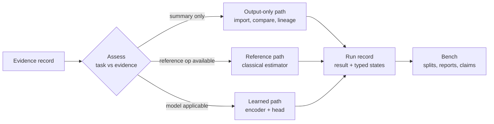

# Crossfade Technical Spec

*2026-09-18 · Jason · v0.3*

Crossfade is a capability-aware evidence and experiment platform for wave-propagation inference. It connects sonar, HF skywave radar and RF systems through a common channel vocabulary anchored on the channel spreading function, and it measures where learned structure transfers instead of assuming it. This is v0.3. It incorporates the architecture review of 2026-09-18, the referee response to it, and the decisions made while writing build pack v0.3, and every requirement below is tagged as an engineering guarantee, a provisional choice, or a hypothesis. Questions for the sonar lead are in section 12. The first one, the target quantity for the first real task, is on the critical path.

**Version history.** v0.1 (2026-09-17): first draft from the synthesis. v0.2 (2026-09-18): adopted the review's contract amendments with three modifications; typed anchor family, per-descriptor regime matching, five record types, four-class transforms, split consistency and content-isolation losses, H2 as a measurement, four build slices. v0.3 (2026-09-18): aligned with build pack v0.3, which is the implementation record for this spec: W1's first generator is an in-house image-source Pekeris waveguide so that truth is the arrival list itself; size budgets enforce the no-framework rule; the twenty-five invariants CF-01 to CF-25 in the pack's contracts document are the test list for the guarantees here.

---

## 1. Scope and claims

Crossfade commits to three separable contracts, and the platform stays useful if only the first holds.

| Contract | Claim | Evidence that it holds |
| --- | --- | --- |
| Interoperability | Any wave-sensing system's outputs can be ingested with units, coordinates, processing history and capability description intact, and replayed | A new domain connects through a domain pack without changing the core; a result reproduces from archived evidence |
| Representation transfer | A shared encoder pretrained on one domain reduces target-domain data needed to estimate a declared quantity | Frozen-encoder few-shot gain over from-scratch at declared budgets, reported with effect size and uncertainty |
| Evidence fusion | Multiple results about one situation combine under a declared dependence model | Duplicate evidence is never double-counted; unknown dependence withholds numerical fusion |

**Three kinds of statement.** Every requirement in this spec is one of the following, and the tag decides how it is treated when it fails.

| Tag | Meaning | On failure |
| --- | --- | --- |
| Guarantee | A property the software enforces: immutability, provenance, typed states, leakage checks, reproducible comparison | Bug; fix the software |
| Provisional | An architectural choice made now and replaceable later: canonical anchor kind, encoder family, storage backend | Swap the component; contracts unchanged |
| Hypothesis | A scientific claim to be measured: transfer at matched regime, usefulness of a regime coordinate, benefit of routing | Record the result in the atlas; the platform is unaffected |

What Crossfade is not:

- Not a universal physics-informed neural network. PDE-residual PINNs fail at high wavenumber through spectral bias. Physics enters as structural priors on the channel and as forward models in domain packs, where available.
- Not an LLM that reads latent vectors. The LLM sits on typed records, explains, retrieves, and drafts pack metadata for human approval.
- Not a replacement for existing processing chains. Legacy systems connect through output-only packs.
- Not a single latent space, and not a required reconstruction of one universal object from every input. Sharing is partial, per descriptor, and earned by benchmark.

Two tensions in the original conversation are resolved as follows. First, "factor out the channel" versus "the channel is the information": a variable is a nuisance relative to a task, never inherently, so each TaskSpec says what is retained, conditioned on, or marginalized. Second, "domain-invariant" versus "no information loss": these cannot both hold in one compressed representation, so the archive preserves the source evidence, each derived representation declares what it retains, and private pathways carry what the shared one drops.

---

## 2. The anchor: a common channel vocabulary

The anchor is a common vocabulary for describing the propagation channel, not a requirement that every input be reduced to one reconstructed object. Every quantity Crossfade estimates is defined as a functional of a named channel representation, so descriptors from two packs are comparable even when neither pack reconstructs the full channel. This is the transcript's claim, that the time-varying impulse response is the common thread, kept as the semantic target and relaxed as a payload requirement. **Provisional.**

**Representations, and a correction to v0.1.** For a linear time-varying channel with input `x(t)` and output `y(t)`, the delay-Doppler spreading function `S_H(τ, ν)` gives

```
y(t) = ∫∫ S_H(τ, ν) x(t − τ) e^{j2πνt} dτ dν
```

Matz, Bölcskei and Hlawatsch (2013) state that virtually any linear channel can be written this way; the representation always exists. v0.1 wrongly said delay-Doppler is "the" narrowband form and delay-scale is "the" wideband form. The correct statement is about sparsity. When `TB · (v/c)` is small, a moving path is one point in `(τ, ν)`. When it is not, the same path is a smear in `(τ, ν)` and a point in the delay-scale spreading function `h(τ, α)`, `α = 1 + v/c`:

```
y(t) = ∫∫ h(τ, α) √α · x(α(t − τ)) dτ dα
```

Altes (1971) and the Mellin-transform literature give the tools for the scale case. Both representations are always valid; one is parsimonious.

**Realization versus statistic.** `S_H` describes one channel realization. Under WSSUS the second-order statistic is the scattering function `C_H(τ, ν) = E|S_H|²`, and the power-delay profile is its marginal in `τ`. These are different objects and every `AnchorEstimate` says which one it holds.

**Typed anchor family.** An `AnchorEstimate` record carries:

| Field | Contract |
| --- | --- |
| `kind` | One of `impulse_response`, `delay_doppler`, `delay_scale`, `power_statistic`, `descriptors_only`; extensible |
| `payload` | Optional labeled array; absent for `descriptors_only` and never fabricated to fill a shape |
| `descriptors` | Named values, each defined as a functional of a named canonical kind, with units |
| `statistical_semantics` | `realization`, `expectation`, `estimate`, `posterior_samples`, or `pseudo_label` |
| `normalization` | Reference scales, sign conventions, acquisition band, transform parameters |
| `identifiable`, `ambiguous`, `assumptions` | Per-quantity identifiability status and the assumptions used |
| `uncertainty` | Typed per section 9, or `unavailable` |
| `regime` | Coordinates per section 3 with provenance and availability |

**Canonical kind per regime.** Each domain pack declares, for each regime box it supports, which kind is canonical, chosen by sparsity, and the tested threshold on `TB · (v/c)` at which it switches. That threshold is pack-declared and tested, not core routing logic. Conversions between kinds are versioned operations tagged `exact`, `approximate`, `lossy` or `unavailable`. The first release implements only the kind the first task needs.

**What the vocabulary carries across domains.** Descriptors defined on the canonical object have counterparts in every wave domain.

| Descriptor | Canonical object | Sonar meaning | HF skywave meaning |
| --- | --- | --- | --- |
| RMS delay spread, resolvable arrival count | Power-delay profile | Surface, bottom, duct multipath | E, F1, F2 modes; ordinary and extraordinary rays |
| Scale or Doppler spread | Scattering function marginal in `ν` or `α` | Source motion, surface scatter | Ionospheric motion, target motion |
| Arrival-structure stability | Time series of the PDP | Sound-speed drift, internal waves | Traveling ionospheric disturbances |
| Interference structure across frequency | Transfer function magnitude | Waveguide-invariant striations | Multimode fading versus frequency |

**Precedent, with its limits.** CSI-CLIP++ (Jiang et al. 2026) pretrains an RF channel encoder by contrastive alignment of CSI and CIR as paired views and transfers to three tasks and across simulators. Its CSI is perfect ray-traced output, its CIR is the IFFT of that CSI, and SNR-dependent noise is not considered. It shows that a channel representation is a workable pretraining target under ideal acquisition. It does not show blind inference from noisy legacy outputs. ImageBind (2023) is the structural lesson that N modalities need N pairings to an anchor, not N² to each other.

---

## 3. Regime coordinates

A regime coordinate is a dimensionless group that a TaskSpec names as a candidate explanatory variable for a specific descriptor. Whether it predicts anything, and whether matching it predicts transfer, is measured. **Hypothesis**, with the record fields as **guarantee**.

**Candidate groups.** The typical values are placeholders until the sonar lead supplies program ranges (section 12).

| Group | Definition | Sonar, placeholder | HF skywave, placeholder | Governs |
| --- | --- | --- | --- | --- |
| `M = v/c` | Radial speed over propagation speed | 1e-3 to 1e-2 | 1e-6 to 1e-5 | Doppler as shift versus scale |
| `β_B = B/f_c` | Fractional bandwidth | 0.3 to 1 | 1e-3 to 1e-2 | With `M` and `TB`, the sparsity criterion of section 2 |
| `Π_τ = τ_spread · B` | Delay spread in resolution cells | 10 to 1000 | 1 to 50 | Arrival resolvability, sparsity prior validity |
| `Π_ν = ν_spread · T` | Doppler or scale spread over observation | 0.1 to 10 | 0.1 to 10 | Coherence, window length, WSSUS validity |
| `Π_L = L/λ` | Aperture in wavelengths | 10 to 100 | 10 to 300 | Angular resolution, mode separability |
| `Π_f = f/f_cutoff` | Frequency over waveguide cutoff | 1 to 50 | 1 to 10 | Propagating mode count, striation structure |
| `Π_h = h_rms · k · sinθ` | Rayleigh roughness of boundary | 0.1 to 10 | 0.1 to 5 | Coherent versus diffuse boundary scatter |
| `SNR_cell` | Per-resolution-cell SNR | −0 to −20 dB | 0 to 30 dB | Whether estimation is detection-limited |

**The overlap result.** The review noted that the placeholder ranges are disjoint in `M` and `β_B`, so a pilot requiring overlap in those coordinates cannot be built. That is correct, and it is more than a pilot bug. If sonar and HF never overlap in the groups governing Doppler, the matching hypothesis itself predicts that Doppler descriptors do not transfer between them, and that whatever transfers lives in the groups that do overlap: `Π_τ`, `Π_ν`, `Π_f`, `Π_L`. Those govern arrival structure and waveguide interference. That is the transcript's "ionosphere as flipped ocean" stated precisely: the shared structure is the waveguide, not the Doppler.

Regime matching is therefore **per descriptor**.

| Descriptor | Governing groups | Sonar-HF overlap (placeholder) | Transfer expectation |
| --- | --- | --- | --- |
| RMS delay spread, arrival count | `Π_τ`, `Π_f`, `SNR_cell` | Partial | Candidate; first pilot target |
| Interference structure, striation slope | `Π_f`, `Π_L`, `Π_τ` | Partial | Candidate; the mechanism test of section 10 |
| Scale or Doppler spread | `M`, `β_B`, `Π_ν` | None in `M`, `β_B` | Predicted not to transfer; serves as the negative control |
| Boundary scatter character | `Π_h` | Partial | Later |

The pilot measures how transfer varies with overlap distance per descriptor. A gain where none is predicted is a finding, not a failed gate.

**Record fields, per coordinate.** Value, provenance (metadata, estimated from permitted inputs, or oracle from simulator truth), uncertainty or missingness, and whether it is available at inference time. Oracle coordinates never reach a deployment-path model or router. In simulation this is the main leakage risk: a coordinate computed from the simulator's true delay spread, feeding a model whose target is delay spread, is the answer in disguise.

**How the set is validated.** IT-π (Yuan and Lozano-Durán 2025) ranks candidate groups by predictive information for a target and bounds the achievable error. Run it per descriptor, per domain. Agreement in ranking across domains is evidence for shared governing physics; disagreement locates where the analogy breaks. IT-π does not validate this set a priori and is not treated as doing so.

The transcript's practical question, what FFT length and window for sonar versus HF, is answered in these coordinates: window length follows `Π_ν`, resolution follows `Π_τ`, and it is one decision in both domains.

---

## 4. Architecture

The eight layers of v0.1 remain as ownership boundaries. Execution is no longer a mandatory linear pipeline through all of them. A run follows one of three paths, chosen deterministically by what the evidence supports. **Provisional** for the paths; **guarantee** for the ownership rules.



| Layer | Owns | Guarantee | Must never |
| --- | --- | --- | --- |
| L0 Evidence | Immutable artifacts, manifest, lineage | Anything derived resolves to what was observed | Overwrite or reinterpret an artifact |
| L1 Domain pack | Operations, priors, regime declarations, transforms, tests | Missing capabilities are explicit | Invent a forward model it does not have |
| L2 Anchor estimators | Pack operations producing `AnchorEstimate` records | Identifiability stated per quantity | Emit a point where the problem is ambiguous |
| L3 Encoder | Learned models, when a TaskSpec allows them | Inputs limited to declared prediction-time fields | See oracle or evaluation-only data |
| L4 Inference | Heads, forward checks where a forward model exists | Every check has a typed state | Report an unavailable check as passed |
| L5 Results | Run records with typed states, lineage | A consumer can tell what supports what | Present shared-lineage views as independent |
| L6 Bench | Splits, leakage checks, reports, claims | Every claim resolves to runs, data, versions | Report a gain without its baseline |
| L7 LLM | Explanations, pack-metadata drafts | Statements cite records | Write a quantity, uncertainty or verdict |

**Simplest implementation that meets this.** One Python package, five modules, no services, no plugin discovery, no workflow engine.

| Module | Holds | Backing |
| --- | --- | --- |
| `records` | `Record` (observation, representation, anchor estimate, all one type with a `kind`), manifest, hashing, store | Files named by content hash; xarray to zarr for arrays; JSON for structured records; SQLite index |
| `tasks` | `TaskSpec` | Pydantic models, versioned |
| `packs` | `Operation` protocol with `assess` and `run`; explicit registry in a config file | Plain Python packages; one `core_api_version` integer |
| `runs` | `Run` (manifest, result, typed states), replay | SQLite rows; outputs are `Record`s |
| `bench` | Split manifests, leakage checker, report, claim | JSON reports; SQLite index |

The review proposed thirteen record types. Five suffice for the first three slices: `Record`, `TaskSpec`, `Operation`, `Run`, `Report`. `CapabilityAssessment` is the return value of `Operation.assess`, not a stored object. `Mapping`, `TransferClaim` and `Review` are sections of a `Report` until a real experiment needs them separated. Estimated size of the first slice is on the order of 1500 lines including tests.

**Runtime.** Single-user local first. SQLite plus a directory of hashed files. Workers are subprocesses with a resource limit. Only explicitly installed packs execute, and that is a trust boundary, not a sandbox. Shared storage and a model registry are chosen when concurrency exists, and that migration is not a scientific redesign.

---

## 5. Evidence and run contracts

Five record types carry the whole platform through the first three slices. They are Pydantic models serialized to JSON, not services and not a database schema per object. **Guarantee** for the invariants; **provisional** for the field lists.

| Type | Role | Key fields |
| --- | --- | --- |
| `Record` | Anything observed or derived: observation, representation, anchor estimate, structured summary | `id`, `kind`, `payload_kind` (array or structured), `payload_ref`, `byte_hash`, `manifest_hash`, `coords`, `units`, `masks`, `source_system`, `acquired_at`, `ingested_at`, `capabilities[]`, `processing_history[]`, `parents[]`, `validation_state` |
| `TaskSpec` | What a run may see and must return | `task_id`, `version`, `task_kind` (transform, estimation, comparison), `allowed_inputs[]`, `quantities{}` with units and definitions, `truth_source`, `normalization`, `regime_coords[]` with availability, `baselines[]`, `metrics[]`, `split_policy`, `uncertainty_requirement`, `completion_rule`, `promotion_rule` |
| `Operation` | A pack's executable unit | `op_id`, `version`, `input_contract`, `preconditions[]`, `assumptions[]`, `output_contract`, `determinism`; methods `assess(task, record)` and `run(task, record, params)` |
| `Run` | One execution attempt and its result | `run_id`, `task`, `op`, `inputs[]`, `params`, `code_rev`, `env_lock`, `seed`, `status` (succeeded, failed, cancelled), `attempt_of`, `result` with typed states per section 9, `outputs[]` |
| `Report` | One declared comparison | `experiment_spec`, `split_manifest`, `runs[]`, `metrics` with denominators, `budgets`, `validity` (valid, invalid, incomplete), `claims[]`, `mappings[]` |

`assess` returns `supported`, `unsupported` or `unknown` with named reasons and missing items. There is no `conditional` state: an assumption an operation needs is a `TaskSpec` parameter, and its absence is `unsupported` with the parameter named. `CapabilityAssessment`, `Mapping`, `TransferClaim` and `Review` from the review are, respectively, a return value, and sections of `Report`, until a real experiment needs them apart.

**Identity.** A `Record` is identified by its byte hash and its manifest hash together. The manifest covers units, coordinates, masks, processing definitions and interpretation version. Identical bytes labeled seconds and milliseconds are different records. Correcting metadata creates a successor with a parent link; the original is never edited. Acquisition time and ingestion time are separate fields.

**Capability descriptions.** The C0 to C3 labels remain as a summary vocabulary and never authorize anything. Each `Record` also lists explicit capabilities, for example `has_phase`, `has_array_geometry`, `has_source_reference`, `has_calibration`, `has_timing`, and each `Operation` lists the ones it needs. A record labeled C3 without a source reference still fails the preflight of an operation that needs one.

| Label | Typical content | Typical capabilities |
| --- | --- | --- |
| C0 | Upstream summary: detections, tracks, scalar features | none of the above; `upstream_asserted` |
| C1 | Magnitude-only time-frequency view | `has_timing` |
| C2 | Complex coefficients: beam-level STFT, range-Doppler cells | `has_phase`, `has_timing` |
| C3 | Element or beam time series with geometry | `has_phase`, `has_array_geometry`, `has_timing`, and whatever else the pack declares |

**Payloads.** Arrays are xarray `Dataset`s with named dimensions and coordinate variables, stored as zarr. Units are validated at ingest with pint; an xarray attribute is a label, not a check. Structured summaries are JSON records, never forced into a tensor. A record missing required physical metadata is archived with `validation_state = quarantined` and is ineligible for analysis until a successor supplies it.

**Lineage.** `parents[]` records derivation only, in the spirit of PROV-O without importing the ontology. Whether two records are statistically independent is a separate judgment made in section 9; shared parents mean shared evidence, and nothing more is inferred from lineage.

**Two paths, one contract.** The operational path ingests C0 to C2 outputs from existing systems and never modifies upstream feature generation. The research path works on C3 archives and simulations. Both use the same five types.

---

## 6. Domain packs

A domain pack is a plain Python package that exposes a manifest and a set of `Operation`s. The core registers packs from an explicit list in a config file; there is no discovery mechanism. The platform owns execution, records and evaluation; the pack owns domain meaning. **Guarantee** for the boundary; **provisional** for the field list.

| Element | Contents | Required |
| --- | --- | --- |
| `manifest` | Name, version, `core_api_version`, operation ids, fixtures | Yes |
| `operations[]` | Each with `assess` and `run`, preconditions, assumptions, determinism | Yes, at least one |
| `regime` | Declared ranges for section 3 groups, marked placeholder or measured; canonical anchor kind per box | Yes, placeholders allowed |
| `transforms` | Every transformation the pack applies or admits, classified per the table below, each with an equivalence test | Yes |
| `tests` | Golden fixtures, known failure cases, regime boundaries where a method stops working | Yes |
| `priors` | Structural assumptions with validity conditions: arrival sparsity, temporal smoothness, modal phase linearity | Optional |
| `forward_model` | Solver or surrogate; declared `unavailable` when absent | Optional |
| `anchor_estimators` | Operations whose output is an `AnchorEstimate` | Optional |
| `vocabulary` | Domain terms mapped to platform quantities, for the explanation layer | Optional |

**Transform classification.** v0.1 called resampling, windowing and carrier retune "conventions." They are not. Under the generative model `y = M_d[F_d(θ; c)] + ε`, a change to `M_d` is lossy processing and a change to `c` is physical intervention. Each transform is classified and tested individually.

| Class | Examples | Expected model behavior | Test |
| --- | --- | --- | --- |
| Exact convention | Unit relabel, sample-index origin, complex sign convention | Invariant | Output identical after inverse conversion |
| Coordinate transform | Array rotation, beam steering, reference-frame change | Equivariant | Output transforms by the declared rule |
| Lossy processing | Resampling, window length and overlap, magnitude-only, decimation, CFAR thresholding | Declared information loss; downstream applicability may change | Retained-information contract stated and checked on fixtures |
| Physical intervention | Carrier retune to a different band, sound-speed profile change, ionospheric state change, source motion | Answer may change | Not an invariance; recorded as a context change |

**Sketch: passive sonar pack.**

- Operations: beamform-and-STFT (lossy, parameters recorded), cepstral arrival estimation, ray-based blind deconvolution, striation-slope estimation, and later a learned descriptor estimator. Each declares preconditions: array geometry, sound speed at the array, band.
- Regime: `M` up to 1e-2, `β_B` up to 1, `Π_f` 1 to 50, all marked placeholder until the sonar lead supplies program values. Canonical kind: `delay_scale` when `TB · (v/c)` exceeds the declared threshold, else `delay_doppler`.
- Priors: sparse ray arrivals with surface and bottom images; approximately linear modal phase in frequency for low-order modes; waveguide-invariant striation slope.
- Forward model: normal-mode or ray model of the waveguide; a neural-operator surrogate of a parabolic-equation solver is a later option.

**Sketch: HF skywave pack.**

- Operations: matched filter and Doppler processing (lossy, parameters recorded), multimode delay-Doppler estimation from range-Doppler cells, sparse CIR reconstruction under interference.
- Regime: `M` around 1e-6, `β_B` around 1e-2, `Π_ν` set by ionospheric coherence time. Canonical kind: `delay_doppler`.
- Priors: few discrete modes with ordinary and extraordinary splitting; slow multiplicative fading; mode delay ordering.
- Forward model: an ionospheric ray tracer over a declared electron-density model.

**Output-only pack.** A legacy system connects with one operation, `import_summary`, no forward model and no anchor estimator. It participates in comparison and lineage warnings, and every request for reconstruction returns `unsupported` with the missing capabilities named. This is how existing programs join without touching their processing chains, and it can ship independently of any transfer result.

---

## 7. Anchor estimators and identifiability

Every anchor estimator states what it can and cannot recover from its inputs. A learned estimator does not remove an identifiability limit; it hides it. The blind convolution model `y = h * s` has at minimum a scale ambiguity (`h/a`, `a s` gives the same `y`) and, without structure, a whole family of ambiguities. Identifiability and stability require assumptions on signal or filter structure (Li, Lee and Bresler 2015). The domain pack supplies those assumptions; the estimator operates inside them.

A capability label never authorizes an estimator. Each estimator's `assess` checks its own preconditions against the record and refuses with the missing items named. Possessing raw samples does not remove the ambiguity; the structural assumption does, and the estimator says which one it used.

**Classical estimators, by capability level.**

| Estimator | Level | Recovers | Assumes | Ambiguous |
| --- | --- | --- | --- | --- |
| Striation slope and waveguide invariant `β` | C1 | Range-rate to range ratio, mode interference structure | Waveguide with a few modes, source broadband | Absolute range without a frequency anchor |
| Cepstral multipath | C1 or C2 | Relative arrival delays, boundary reflection structure | Minimum-phase-ish channel, arrivals separable in quefrency | Arrival ordering when delays overlap |
| Artificial or synthetic time reversal | C3 | Source waveform and source-to-array impulse response | Linear modal phase in frequency, known array geometry and local sound speed | Overall delay and scale |
| Ray-based blind deconvolution | C3 | Impulse response and source waveform, broadband | Resolvable ray arrivals, known array geometry | Source spectrum absolute level |
| Bilinear channel models for sources of opportunity | C3 | Channel from unknown but structured sources | Source lies in a known low-dimensional subspace | Source-channel split within the subspace |
| Wideband ambiguity or Mellin-domain scale estimation | C2 or C3 | Scale `α` and delay `τ` jointly | Known or estimated source waveform, wideband regime | Sign of scale for symmetric spectra |
| Delay-Doppler multimode estimation | C2 | Mode delays and Dopplers | Narrowband regime, few discrete modes | Ordinary-extraordinary assignment |
| Sparse CIR reconstruction under interference | C2 | Full-band CIR from partial spectrum | Sparse arrivals, temporal smoothness | Arrivals within one resolution cell |

**Learned estimators.** Trained on the pack's forward model with the same structural priors as losses (sparsity in delay, smoothness in time, forward consistency through `M_d`), following the physics-informed transformer precedent that reached power-delay-profile similarity 0.82 versus 0.62 for the best baseline at fifty percent spectrum occupancy. A learned estimator inherits the classical estimator's assumption list and must declare its training regime box.

**The overlapping-source problem.** The transcript's Ninja case, many sources superposed in one band with multipath traces that cannot be associated to sources, is blind multichannel source separation. It is not solved by a better encoder. It becomes tractable when the pack supplies the structure that makes it identifiable: a subspace for the sources, the array manifold, and the sparsity of each source's arrival set. The bilinear-model work on sources of opportunity is the acoustic template; the RF analog is a research item for the pilot.

**Estimator output.** An `AnchorEstimate` record per section 2: a `kind`, an optional payload, named descriptors defined as functionals of the canonical kind, `statistical_semantics`, and the three lists `assumptions`, `identifiable`, `ambiguous`. A downstream head that needs a quantity in `ambiguous` returns a distribution over the alternatives or abstains; it never returns a point. An estimated anchor used as a training target is a `pseudo_label`, and the record says so.

**What is deliberately not in scope here.** The platform estimates channels and their structure. Detection, classification and tracking heads sit on top of `Result` objects and are owned by each program's existing systems or by later task-specific work.

---

## 8. Models and training objective

The first learned candidate is a dense shared/private encoder with domain adapters, trained only after the baseline ladder below has been run. Regime-routed mixture of experts is an ablation arm, not the architecture. **Provisional** for the candidate; **hypothesis** for every claim that one arm beats another.

**Baseline ladder, in order.** Every arm above the first is compared to every arm below it at declared budgets.

| Arm | Tests whether |
| --- | --- |
| 1. Classical or direct calculation | The task needs learning at all |
| 2. Physically normalized features plus a linear or small head | A network is needed beyond nondimensionalization |
| 3. Independent per-domain model from scratch | Sharing beats specialization |
| 4. Target-only self-supervised pretraining | Unlabeled target data alone suffices |
| 5. Pooled model with a domain token | Sharing needs structure or just data |
| 6. Dense shared/private with domain adapters | Private pathways matter |
| 7. Regime-routed experts (section 10, S9 ablation) | Routing earns its complexity |

Why routing is demoted from v0.1: the 2026 result that motivated it covers two fluid regimes and reports domain-separated routing with low validation error. That is evidence routing can avoid gradient conflict between incompatible regimes. It is not evidence that routing is best for inverse channel tasks, and a router fed regime coordinates that trivially predict the target is not discovering physics. The 2026 benchmark showing physics foundation models to be conditional generalists, with negative transfer in a substantial fraction of cases, stands and is why arm 3 is mandatory.

**Losses.** Each is individually validated in the literature; their composition is the hypothesis.

| Loss | Form | Views or inputs | Claim it supports |
| --- | --- | --- | --- |
| L1 Masked modeling | Reconstruct masked patches of the native view | Unlabeled archives per domain | Label-free pretraining; masked spectrogram modeling for radio, Radio-FM, EMind |
| L2a Representation consistency | Contrastive between deterministic re-representations of one recording: waveform, gram, estimated CIR | Same recording, deterministic transforms | Encoder consistency across representations; what CSI-CLIP++ demonstrates. Not identifiability |
| L2b Content isolation | Contrastive between views with independent nuisance variation | Different sub-arrays of one event; different time windows of a stationary source; different upstream chains on one recording; controlled simulation pairs (same channel, different source; same source, different channel) | Isolation of shared physical content up to an invertible map, per von Kügelgen et al. and Gresele et al. The alignment basis |
| L3 Cross-domain anchor alignment | Contrastive between `z_shared` of records from different domains whose canonical-kind descriptors match, restricted to the descriptor's overlapping regime box | Descriptor-matched pseudo-pairs, tagged as such | Sharing where physics says it may exist; never whole-domain alignment (Zhao et al. 2019) |
| L4 Structural physics | Arrival sparsity in `τ`, temporal smoothness of `h`, forward consistency where `F_d` exists | Anchor estimates | The physics-informed part that applies to channels (Zubow et al. 2026; Sabra and Dowling) |
| L5 Transform consistency | Invariance under exact conventions only; equivariance under coordinate transforms; tested behavior under lossy processing | Pack transform declarations | Section 6 classification |
| L6 Private preservation | Reconstruct native view from `(z_shared, z_private)`; orthogonality penalty | All | Domain detail retained (Domain Separation Networks) |

v0.1 conflated L2a and L2b. A spectrogram is a deterministic function of the waveform, so contrastive learning on that pair cannot strip a nuisance that is not there. Only L2b is claimed as an alignment basis, and it requires views that actually vary independently. Plan 1's controlled-variation simulation matrix is the cleanest source of such views and is now the primary one.

**Pretraining plan.** L1 begins once the split policy and transform contracts are frozen and test membership is fixed; "unlabeled" does not exempt data from exposure rules. L2a and L4 follow once anchor estimates exist. L2b requires paired views from section 10's pairing protocol. L3 runs only at declared regime overlap per descriptor. L5 and L6 throughout. Task heads last.

**Budgets.** Arms are compared on declared controlled variables, with the rest reported. Adaptation efficiency (target labels, target unlabeled exposure, adaptation compute) and total cost (simulation, pretraining, tuning, inference) are two separate views. For any sparse arm, active and total parameters are both reported.

**Not the objective.** Latent overlap, embedding visualizations, and domain indistinguishability under a discriminator are not success criteria.

---

## 9. Inference, uncertainty and typed states

Every `Run.result` carries five independent state fields. No single Boolean stands in for them, and no state is ever filled by default with a passing value. **Guarantee.**

| Dimension | States | Rule |
| --- | --- | --- |
| Execution | `succeeded`, `failed`, `cancelled` | A failed run publishes no quantities |
| Answer | `complete`, `partial`, `abstained`, `unsupported` | `partial` names what is missing |
| Applicability | `in_scope`, `out_of_scope`, `unknown` | `unknown` is the default, never `in_scope` |
| Forward check | `passed`, `failed`, `unavailable`, `not_applicable` | Absent forward model means `unavailable`, never `passed` |
| Uncertainty | `posterior`, `confidence_interval`, `predictive_interval`, `ensemble_summary`, `unavailable`, `not_applicable` | A deterministic transform is `not_applicable`; a learned estimate without validated uncertainty is `unavailable` |

Each quantity in a result is tagged `upstream_asserted`, `computed`, or `inferred`, so a consumer can tell a legacy system's own confidence from a Crossfade estimate.

**Inference methods.** Not one algorithm. A deterministic transform returns a value. A classical estimator returns a value and whatever error characterization its literature supports. Where a pack has a forward model and a prior, simulation-based inference is the preferred route to a posterior: train a neural posterior estimator on `(θ, M_d[F_d(θ)] + ε)` pairs and amortize on real observations, using the `sbi` library before anything custom, with the diagnostics the SBI guides prescribe. SBI is a method a pack may use, not a return type the platform demands.

**Forward validation.** Where `F_d` and `M_d` exist, the engine predicts what the pack would observe under the inferred explanation and compares at the observation level actually available. A check on data that trained the estimator is labeled in-sample. Agreement is necessary and not sufficient; when the posterior is multimodal or an `ambiguous` quantity is involved, `alternatives[]` is populated.

**Uncertainty record.** Beyond its kind, an uncertainty carries the estimand, the conditioning information, the method and version, and the population and regime box on which it was validated. A result that plugs in a point anchor estimate says `conditional_on_plugin` and names the estimate; otherwise the anchor's own uncertainty is propagated. Post-hoc calibration degrades under shift (Ovadia et al. 2019) and conformal guarantees hold under exchangeability or specific departures (Barber et al.), so `applicability` is reported alongside every uncertainty and `unknown` is a legitimate value.

**Abstention.** A head may abstain when applicability is `out_of_scope` or `unknown`, or when a forward check fails a declared threshold. Abstentions are runs with `answer = abstained`, so the abstention rate is a metric with a denominator.

**Fusion.** Two rules ship in v0.2, and nothing more. First, results derived from the same `Record` or from records sharing a parent are one piece of evidence; the fusion layer keeps the more conservative and never multiplies them. Second, results with unknown model-error dependence are compared side by side and not combined numerically. A combination rule beyond these needs its own association contract, dependence model and calibration test, and is deferred to the fusion slice.

---

## 10. Evaluation protocol and the atlas

An experiment is complete when a preregistered comparison ran validly and produced a report. A model is promoted when the report supports its declared utility. A hypothesis is supported, contradicted, or inconclusive. These are three different gates and none implies another. **Guarantee** for the gates and the firewall; **hypothesis** for H1 to H5.

**Hypotheses, reformulated from v0.1.**

| Id | Statement | Reported as |
| --- | --- | --- |
| H1 | For a fixed descriptor and budget, source pretraining produces a practically meaningful target gain where the descriptor's governing groups overlap | Effect `delta = baseline_loss − candidate_loss` with uncertainty at the independent unit; verdict supported, evidence-against, or inconclusive |
| H2 | Transfer varies with overlap distance per descriptor | The transfer surface; a gain outside predicted overlap is a finding, never a failed gate |
| H3 | Conditioning on regime coordinates improves held-out utility over simpler arms under interventions that separate regime from domain identity | Ablation result; routing telemetry alone is not evidence |
| H4 | A named mechanism (waveguide interference structure) estimated in one bounded dispersive waveguide remains predictive in another and beats shortcut controls | Primary mechanism test, after the correspondence and observable are approved by the sonar lead |
| H5 | Uncertainty quality survives shift, or applicability flags it | Coverage, informativeness, accepted-case error, abstention rate, all with denominators |

**Three gates.**

| Gate | Question | Passes when |
| --- | --- | --- |
| Delivery | Did the declared arms run validly and reproducibly? | All required arms present, leakage checks pass, report rebuilds from persisted runs |
| Scientific | What does the result support? | A scoped claim with effect, uncertainty, budgets and limitations is recorded, whatever its direction |
| Promotion | Is the model useful for its declared inputs? | Preregistered utility and uncertainty criteria met on the declared independent unit |

A crash is not negative transfer. Lack of significance is not evidence of no effect. An invalid or incomplete report produces no claim.

**Feature and truth firewall.** Every input field is one of: prediction-time metadata, prediction-time measured evidence, prediction-time estimate, training-only supervision, evaluation-only reference. The deployment-path feature builder can reach only the first three, through a different handle, not by convention. Oracle-regime arms run through a separately labeled diagnostic path and cannot satisfy the promotion gate. Estimated anchors used to make pairs are pseudo-labels and carry their estimator version and lineage.

**Splits.** At the independent unit the task declares: session, environment, instrument, scene or source recording. Every derived window, transform and augmentation inherits its root group; the checker verifies no root crosses partitions. Test membership is frozen before any pretraining. Normalization, regime selection, pairing thresholds and calibration are fit on training and development partitions only.

**Pairing.** Every pair record declares its basis: same measured event; controlled corresponding mechanism across independent simulators; descriptor-matched pseudo-pair; or deliberately unpaired negative. These are different kinds of supervision and are never pooled. Shuffled-pair and nuisance-matched controls are run where the task's shortcut risks call for them.

**Simulator independence.** Cross-domain claims from simulation need both: no shared forward-physics kernel between the two generators, and a written independence statement covering scene distribution, approximation family and truth construction. Code independence is the cheap auditable proxy; assumption independence is the target. Neither substitutes for the other, and neither substitutes for measured-data validation.

**Budgets.** Two views, always both: adaptation efficiency (target labels, target unlabeled exposure, adaptation compute) and total cost (simulation, pretraining, tuning, inference, amortization assumptions). Declare which variables are controlled; report the rest.

**Records.** A `Run` is one attempt. A `Report` aggregates runs into one comparison with validity `valid`, `invalid` or `incomplete`, and holds `claims[]`, each scoped by direction, descriptor, regime cells actually tested, model version and budgets, with outcome `supported`, `evidence_against` or `inconclusive`. A `mapping` is recorded only for an implemented correspondence, never for every experiment. Tested support is the set of evaluated cells, not the bounding box around them.

**Decision rule.** Baseline variability is estimated on development data, the meaningful effect for the task is agreed, and the rule is frozen before the locked test is viewed. Exploratory runs are labeled exploratory and are still recorded.

---

## 11. Build slices and gates

The review's twelve slices are consolidated to four that ship now and three that wait for a reason to exist. Each slice is a complete user-visible operation, sequenced by dependency gates. Durations are planning estimates for the funding conversation, not commitments, and they assume the sonar lead's inputs from section 12 arrive in the first two weeks. **Provisional.**

| Slice | Merges | User-visible deliverable | Gate to pass | Estimate |
| --- | --- | --- | --- | --- |
| W0 Workbench | S00, S01, S02 | Ingest a supplied profile, compute the T0 descriptor, preserve units and lineage, replay it, and refuse reconstruction on a summary-only record. One demo, one test suite | Delivery: all T0 and summary-fixture acceptance tests pass offline | 2 to 3 weeks, one engineer |
| W1 First real task | S03, S04 | Estimate RMS delay spread and resolvable-arrival count from simulated beam time series through a classical estimator, benchmark it with grouped splits and a leakage checker, record a report | Delivery plus scientific: classical baseline characterized, not assumed exact | 4 to 6 weeks, two people |
| W2 Second domain and transfer | S05, S06, S07 | One HF pack, one SSL pretraining arm, one preregistered transfer trial with typed uncertainty, per the section 10 protocol | Scientific: a scoped claim, whatever its direction | 8 to 12 weeks, two to three people |
| W3 Output-only adapter | S08 | Read-only import of one existing system's summaries, comparison, duplicate-evidence warnings, no upstream change | Delivery | 2 to 3 weeks, parallel to W1 |
| Later: routing | S09 | Dense versus routed ablation | Only after W2 shows a dense arm worth beating | Deferred |
| Later: explanations | S10 | LLM over records; pack-metadata drafts | After W1 records are stable | Deferred |
| Later: fusion | S11 | Numerical combination under a declared dependence model | After a use case exists | Deferred |

**Why the merges.** S00, S01 and S02 are tested by the same T0 demo and the review already says to build them together; splitting them produces three PRDs for one afternoon's fixture. S07 is not a slice: uncertainty is a property of each estimator in W1 and W2, and shipping estimators without it contradicts section 9. S05 and S06 are one research charter with two arms.

**Why W1 starts now.** The review sequences the contracts against T0 and defers the first real task until a quantity is signed off. Contracts shaped only by a toy get reshaped by the first real task. W1's proposed quantity is chosen so the sonar lead can confirm or replace it in one exchange: RMS delay spread and resolvable-arrival count are functionals of the power-delay profile, have exact truth in simulation, have classical estimators the lead already runs, and sit in the regime groups that plausibly overlap with HF. W0 and W1 are specified together and the contracts grow from both.

**Simulators for W1 and W2.** W1 acoustic: an in-house image-source Pekeris waveguide (isovelocity water column over a fluid half-space), chosen because truth is the arrival list itself, it is a few hundred lines, and it has no license question; its limitation is no refraction, so a normal-mode or ray code the sonar lead already runs is the second generator for W2 and the reality gate. W2 HF: an in-house discrete-mode skywave model over a Chapman-layer ionosphere, with a published ray tracer as the second generator once its license and callable form are verified. The two share no physics kernel and carry a written independence statement per section 10, which must name the one approximation they do share: discrete paths with per-path delay and gain, which is the anchor assumption itself. The regime grid is designed per descriptor so that arrival-structure descriptors have overlapping cells and Doppler descriptors do not.

**Data.** Public ocean-acoustic experiments with known sources and measured environments, and public measured RF channel sets, are the reality-gate candidates. The specific datasets, their fields and their truth are an open question in section 12; no reality claim is scheduled until they are named.

**What each gate refuses.**

- W0: any anonymous tensor; any record without explicit capabilities; any fabricated default for a missing unit or reference.
- W1: any learned-arm result without arms 1 to 3 of the section 8 ladder; any random-window split.
- W2: any gain measured on one simulator relabeled; any oracle coordinate on the deployment path; any calibration claim validated only on the training regime.
- W3: any write to upstream processing; any duplicate evidence counted twice.

**Team.** One person on packs and estimators (the sonar lead's domain), one on the core and bench, and from W2 one on models. Nothing in W0 to W3 needs more.

---

## 12. Open questions for the sonar lead

The first block is on the critical path: W1 cannot be specified without it. The rest can arrive over the first month. Each is phrased so a paragraph or a pointer settles it.

**The first real task (blocks W1)**

- [ ] Is RMS delay spread plus resolvable-arrival count from beam time series the right first descriptor? If not, which functional of the power-delay profile or scattering function would you pick, and why?
- [ ] Which propagation code should generate truth for it, and what are that code's known accuracy limits in dB and in which regimes?
- [ ] Which classical estimators for it do you already run (cepstral, ray-based deconvolution, other), at which capability level, and what are their known failure regimes?
- [ ] What metadata is genuinely available at inference time for a real recording: array geometry, local sound speed, band, nothing else?

**Anchor and regime**

- [ ] Do the program regime ranges for `M`, `β_B`, `Π_τ`, `Π_ν`, `Π_f` and per-cell SNR match the placeholders in section 3? Replace them.
- [ ] Is the delay-scale form the right canonical kind for the passive wideband case, or does the modal picture carry structure that delay-scale loses at the ranges you care about?
- [ ] Does one "medium variability rate" (sound-speed-profile correlation time over observation time) capture what matters, or do internal waves and fronts need their own coordinate?
- [ ] For HF: is the ionosphere-as-flipped-ocean analogy strong enough that a waveguide-invariant-like descriptor should exist in multimode returns? What would you look for first?

**Estimators and identifiability**

- [ ] In the overlapped-source case, what specifically breaks the cepstral method: arrival-delay collisions, source-spectrum non-stationarity, or association?
- [ ] Is there a source subspace assumption (narrowband tonals plus broadband continuum) that would make the overlapped-source problem identifiable in the bilinear sense?
- [ ] Below what `Π_τ` is arrival sparsity not a usable prior?

**Data**

- [ ] Which archives exist at C3 and could be cleared for research pretraining? Volume and span?
- [ ] Which public ocean-acoustic datasets do you trust for the reality gate, and which environmental truth do they carry?
- [ ] Is there any paired data, one event seen by an acoustic and an RF system, or is cross-domain pairing purely descriptor-matched?

**Scope**

- [ ] Should the first HF pack target skywave OTH, or a simpler narrowband RF channel with richer public data, with OTH second?
- [ ] Is a C0 output-only adapter for the current operator tool the right W3 target, or is there a C2 system that gives a stronger first integration?

**On the review**

- [ ] The spec now composes plan 1's inference formulation with plan 2's workbench and the review's contracts. Does the composition lose anything you valued in either?
- [ ] Unlabeled pretraining starts as soon as splits are frozen, ahead of any benchmark result. Do you see a risk in that?

---

## 13. Sources

Every paper below was opened and checked on 2026-09-17 or 2026-09-18. Grouped by what it settles for this spec.

**The anchor and its regimes**

- Matz, Bölcskei, Hlawatsch, [Time-Frequency Foundations of Communications: Concepts and Tools](https://arxiv.org/abs/1307.4790), IEEE SPM (2013). States that virtually any linear channel is a superposition of time-frequency shifts, with scaling more parsimonious in the wideband regime; distinguishes the spreading function from the scattering function
- Matz and Hlawatsch, [Fundamentals of Time-Varying Communication Channels](https://booksite.elsevier.com/samplechapters/9780123744838/9780123744838.pdf) (2011)
- Altes, [Some invariance properties of the wide-band ambiguity function](http://www.norbertwiener.umd.edu/crowds/documents/Altes71a.pdf) (1971); [Time-scale domain characterization of non-WSSUS wideband channels](https://link.springer.com/article/10.1186/1687-6180-2011-123) (2011)
- Jiang, Yu, Li, Gao, Xu, [CSI-CLIP++: A Scalable Channel Foundation Model via CIR-CSI Consistency](https://arxiv.org/abs/2606.25714) (2026). Perfect ray-traced CSI from DeepMIMO, CIR by IFFT, SNR-dependent noise not considered
- Girdhar et al., [ImageBind: One Embedding Space To Bind Them All](https://arxiv.org/abs/2305.05665), CVPR 2023

**Regime coordinates**

- Bakarji et al., [Dimensionally Consistent Learning with Buckingham Pi](https://arxiv.org/abs/2202.04643) (2022)
- Yuan and Lozano-Durán, [Dimensionless learning based on information](https://arxiv.org/abs/2504.03927), Nature Communications (2025)

**Negative transfer and routing**

- Chu et al., [Do Physics Foundation Models Learn Generalizable Physics?](https://arxiv.org/abs/2605.29283) (2026)
- Sharma and Sharma, [Eradicating Negative Transfer in Multi-Physics Foundation Models via Sparse MoE Routing](https://arxiv.org/abs/2605.15179) (2026)
- Gulrajani and Lopez-Paz, [In Search of Lost Domain Generalization](https://arxiv.org/abs/2007.01434) (2020)
- Zhao et al., [On Learning Invariant Representations for Domain Adaptation](https://proceedings.mlr.press/v97/zhao19a.html), ICML 2019

**Identifiability and alignment basis**

- Locatello et al., [Challenging Common Assumptions in Unsupervised Disentanglement](https://proceedings.mlr.press/v97/locatello19a.html), ICML 2019
- Gresele et al., [The Incomplete Rosetta Stone Problem](https://arxiv.org/abs/1905.06642), UAI 2020
- von Kügelgen et al., [Self-Supervised Learning with Data Augmentations Provably Isolates Content from Style](https://arxiv.org/abs/2106.04619), NeurIPS 2021
- Li, Lee, Bresler, [Identifiability and Stability in Blind Deconvolution under Minimal Assumptions](https://arxiv.org/abs/1507.01308) (2015)
- Bousmalis et al., [Domain Separation Networks](https://arxiv.org/abs/1608.06019) (2016)

**Physics-structured priors and blind channel estimation**

- Sabra and Dowling, [Blind deconvolution in ocean waveguides using artificial time reversal](https://pubs.aip.org/asa/jasa/article-abstract/116/1/262/541692/), JASA 2004; [Ray-based blind deconvolution in ocean sound channels](https://doi.org/10.1121/1.3284548), JASA 2010; [Blind deconvolution of sources of opportunity using bilinear channel models](https://pubmed.ncbi.nlm.nih.gov/33138520/), JASA 2020
- Zubow et al., [Physics-Informed Transformer for Multi-Band Channel Frequency Response Reconstruction](https://arxiv.org/abs/2604.01944) (2026)
- Rouseff and Zurk, [Striation-based beamforming for estimating the waveguide invariant](https://pubs.aip.org/asa/jasa/article/130/2/EL76/957680/), JASA 2011; [Waveguide Invariant-Based Range Estimation in Shallow Water](https://arxiv.org/html/2412.02201v1) (2024); Cockrell and Schmidt, [Robust passive range estimation using the waveguide invariant](https://acoustics.mit.edu/faculty/henrik/LAMSS/Pubs/cockrell_schmidt_jasa_127_p2780-2789_2010.pdf), JASA 2010
- [Mitigation of multi-path propagation artefacts with adaptive cepstral filtering](https://arxiv.org/pdf/2512.11165) (2025); [Toeplitz-based blind deconvolution of underwater acoustic channels](https://www.sciencedirect.com/science/article/abs/pii/S016516842030356X)
- Krishnapriyan et al., [Characterizing possible failure modes in physics-informed neural networks](https://arxiv.org/abs/2109.01050), NeurIPS 2021

**Applied transfer evidence in sonar and RF**

- Mohammadi et al., [Cross-Domain Knowledge Transfer for Underwater Acoustic Classification Using Pre-trained Models](https://arxiv.org/abs/2409.13878) (2024)
- Huang et al., [Few-Shot Radar Signal Recognition through SSL and RF Domain Adaptation](https://arxiv.org/abs/2501.03461) (2025)
- [Self-Supervised Radio Pre-training: Masked Spectrogram Modeling](https://arxiv.org/abs/2411.09849) (2024); [Radio-FM](https://arxiv.org/html/2608.05793) (2026); [EMind](https://arxiv.org/pdf/2508.18785) (2025); [SpectrumFM](https://arxiv.org/html/2508.02742), IEEE JSAC 2026
- [NEC self-supervised underwater acoustic foundation model](https://www.militaryaerospace.com/sensors/news/55399925/nec-develops-underwater-acoustic-ai-model-for-sonar-analysis), contract announced 2026

**Forward surrogates and operator learning**

- Kovachki et al., [Neural Operator: Learning Maps Between Function Spaces](https://jmlr.org/papers/v24/21-1524.html), JMLR 2023; Li et al., [Fourier Neural Operator](https://arxiv.org/abs/2010.08895) (2020)
- Alkin et al., [Universal Physics Transformers](https://arxiv.org/abs/2402.12365), NeurIPS 2024
- Herde et al., [Poseidon: Efficient Foundation Models for PDEs](https://arxiv.org/abs/2405.19101), NeurIPS 2024
- McCabe et al., [Walrus: A Cross-Domain Foundation Model for Continuum Dynamics](https://arxiv.org/abs/2511.15684), ICML 2026
- Wiesner et al., [Towards a Physics Foundation Model](https://arxiv.org/abs/2509.13805) v4 (2026)
- Sun et al., [PROSE-PDE](https://arxiv.org/abs/2404.12355) (2024); Hmida et al., [CompNO](https://arxiv.org/abs/2601.07384) (2026)
- Yang et al., [In-Context Operator Learning](https://arxiv.org/abs/2304.07993), PNAS; Kalia et al., [Normal form autoencoders](https://arxiv.org/abs/2106.05102) (2021)
- [FNO-enhanced parabolic equation framework for underwater acoustic field prediction](https://www.frontiersin.org/journals/marine-science/articles/10.3389/fmars.2025.1692899/full), Frontiers in Marine Science 2025
- [Efficient and High-Accuracy Ray Tracing in Discretized Ionospheric Models](https://arxiv.org/html/2506.18579) (2025); [Open source code for modeling radio wave propagation in the ionosphere](https://www.frontiersin.org/journals/astronomy-and-space-sciences/articles/10.3389/fspas.2025.1521497/full) (2025)

**Inference and uncertainty**

- Deistler et al., [Simulation-Based Inference: A Practical Guide](https://arxiv.org/abs/2508.12939) (2025); Dax, Heimel, Louppe, [An Introduction to Bayesian and Frequentist SBI with Machine Learning](https://arxiv.org/abs/2607.21702) (2026); the [sbi library](https://sbi.readthedocs.io/en/latest/)
- Ovadia et al., [Can You Trust Your Model's Uncertainty?](https://arxiv.org/abs/1906.02530), NeurIPS 2019
- Tishby, Pereira, Bialek, [The information bottleneck method](https://arxiv.org/abs/physics/0004057) (2000)

**Infrastructure**

- [xarray data structures](https://docs.xarray.dev/en/stable/user-guide/data-structures.html); [MLflow model registry](https://mlflow.org/docs/latest/ml/model-registry/); [W3C PROV-O](https://www.w3.org/TR/prov-o/)

**Source documents for this spec**

- `archive/context.md`: transcript of the sonar and ML leads' conversation
- `archive/plan1.md`: first-principles plan; `archive/plan2.md`: physics-modeling plan; `archive/synthesis.md`: the referee document
- `archive/review/01_architecture_review.md`, `archive/review/02_contract_amendments.md`: the v0.2 review; `archive/review/03_referee_response.md`: the claim-by-claim response adopted here; `archive/review/04_build_pack_assessment.md`: what was kept, merged and cut from the v0.2 pack
- `build_pack/`: build pack v0.3, the implementation record this spec is built against: meta-architecture, five contracts, repo layout, evaluation protocol, slices W0 to W3, decision register, data and simulators, four PRDs, templates
- `archive/crossfade_build_pack_v0_2/`: superseded; retained as the record of the review's proposals
