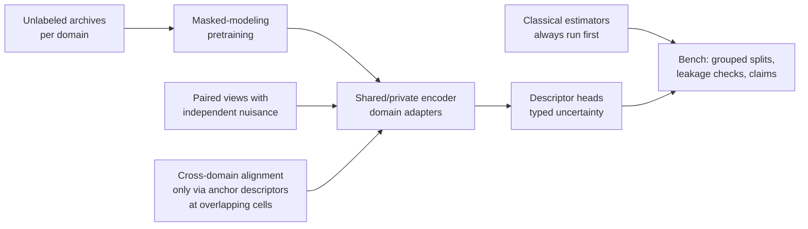

# Crossfade in Two Pages

*2026-09-18 · Jason*

Crossfade is the version of our conversation that survived two rounds of review. The idea you put on the table, that the channel is the common thread across sonar, HF and RF and that if you can estimate the scattering function you have won, is still the center. What changed is that we now know exactly which parts of it the physics supports, which parts are hypotheses to measure, and where the machine learning and the language model sit so they cannot quietly take over the science.

## 1. Your claim, made precise

You said every display we look at, range-Doppler map or beam spectrogram, is a measurement of the channel's response, and that the time-varying impulse response or scattering function is what actually carries the answer. We kept that as the semantic center and relaxed it as a payload requirement.

The anchor is a **vocabulary**, not a reconstruction. Every quantity Crossfade estimates is defined as a functional of a named channel representation: RMS delay spread is a functional of the power-delay profile, which is a marginal of the scattering function. A pack that only produces descriptors still says which functional of which object it is estimating. That one string per quantity is the whole mechanism that makes a sonar descriptor and an HF descriptor comparable, and it costs nothing.

One correction to our first draft, which you would have caught. We wrote that delay-Doppler is "the" narrowband form and delay-scale "the" wideband form. Matz, Bölcskei and Hlawatsch are explicit that any linear channel is a superposition of time-frequency shifts; the delay-Doppler spreading function always exists. What changes with `TB · (v/c)` is sparsity: a moving path that is one point in `(τ, ν)` for HF is a smear there for a maneuvering source in a wideband sonar band, and a point in delay-scale `(τ, α)`. So each domain declares a canonical kind chosen by sparsity, with a tested threshold, and the realization (`S_H`) is never confused with the second-order statistic (`C_H = E|S_H|²`).

## 2. What the physics says transfers, and what does not

You asked what FFT lengths and windows to use for HF versus sonar and called it the practical engineering problem. It is, and it has one answer in both domains once written in dimensionless groups: window length follows Doppler spread over observation time, resolution follows delay spread times bandwidth. So we treat those groups as the coordinates a regime lives in, and "regime" stops being a label.

The reviewer noticed something in our own numbers that turned out to be the most useful result so far. Sonar and HF never overlap in `v/c` or in fractional bandwidth. If the hypothesis is that structure transfers where the governing groups match, then the hypothesis itself predicts that **Doppler structure does not transfer between sonar and HF**, and that whatever transfers lives in the groups that do overlap: delay spread in resolution cells, modes above cutoff, aperture in wavelengths. Those govern arrival structure and waveguide interference. That is your "ionosphere is the ocean flipped upside down" stated precisely: the shared thing is the waveguide, not the Doppler.

| Descriptor | Governing groups | Sonar to HF | Role in the first experiment |
| --- | --- | --- | --- |
| RMS delay spread, resolvable arrival count | `Π_τ = τ_spread · B`, `Π_f = f / f_cutoff`, per-cell SNR | Overlap | First transfer candidate |
| Striation slope, interference structure | `Π_f`, `Π_L = L/λ`, `Π_τ` | Overlap | The mechanism test: does the waveguide-invariant idea have an HF analog |
| Scale or Doppler spread | `v/c`, `B/f_c`, `ν_spread · T` | None | Predicted negative control |

So matching is per descriptor, and the pilot measures how transfer falls off with distance in each group rather than demanding a yes or no. A gain where none is predicted is a finding, not a failed gate.

## 3. Where physics ends and identifiability begins

You raised the cepstral and blind channel-estimation work and the Ninja problem, many sources in one band whose multipath traces cannot be assigned to a source. The literature says what you already know from doing it: `y = h * s` has a scale ambiguity at minimum and a family of ambiguities without structure, and uniqueness comes from assumptions on the source or the filter, never from the estimator. Sabra and Dowling's artificial time reversal works because low-order modal phase is nearly linear in frequency and the array geometry is known. The bilinear-model work on sources of opportunity works because the source lives in a known subspace.

That is the rule we built the platform around. **A learned model does not remove an identifiability limit; it hides it.** So every estimator, classical or learned, states what it assumed, what it can recover, and what stays ambiguous, and a downstream head that needs an ambiguous quantity returns a distribution over the alternatives or abstains. Having raw element data does not authorize an estimator; the estimator's own preconditions do. The Ninja association problem is blind multichannel separation, and it becomes tractable when the domain pack supplies the structure that makes it identifiable: a source subspace, the array manifold, sparsity of each source's arrival set. That is a question for you in section 6, not something an encoder will discover.

## 4. How the ML is stitched in

You asked what training objective would align the spaces naturally, without carving them up by hand. The answer we landed on is a ladder, not a model, and physics constrains every rung.

**Classical first.** Every experiment runs the direct calculation and your estimators before any network, and a learned arm has to beat them at declared budgets. This is the DomainBed lesson: well-tuned simple baselines are hard to beat and most published gains vanish against them.

**Unlabeled data is the fuel.** Masked modeling on operational archives is what the RF foundation models do now and what the NEC underwater effort is doing. It starts the day the test split is frozen. This is the cheapest thing on the list and it is what the domain-expert tier will be built on regardless.

**Which paired views actually isolate physics.** Our first draft claimed that contrasting a waveform with its own spectrogram and its own estimated CIR would make the shared content identifiable. That is wrong, and you would have said so: a spectrogram is a deterministic function of the waveform, so there is no nuisance to strip. The identifiability results need views that vary independently. Different sub-arrays on one event. Different time windows of a stationary source through a slowly varying channel. Different upstream processing chains on one recording. Simulation pairs with controlled variation: same channel, different source; same source, different channel. Those give the alignment basis; the deterministic re-representations only test that the encoder is consistent, which is what CSI-CLIP++ demonstrates under ideal ray-traced CSI.

**Cross-domain alignment only through the anchor, only where cells overlap.** Never align acoustic and RF datasets wholesale; Zhao and colleagues showed invariant representations can destroy exactly the distinctions the target task needs. Shared and private pathways both survive, per Domain Separation Networks, and the private path is not noise.

**Routing is an ablation.** The 2026 result that motivated a regime-routed mixture of experts covers two fluid regimes. It earns a place as the last rung, not the architecture. The 2026 benchmark showing physics foundation models are conditional generalists, with negative transfer common, is why the independent from-scratch arm is mandatory.

**Uncertainty is typed, not scored.** A deterministic transform says not-applicable. A classical estimator carries a block bootstrap. Where a pack has a forward model and a prior, simulation-based inference gives a posterior. A learned estimate without validated uncertainty says unavailable, and "validated on which regime cells" travels with every number. Post-hoc calibration degrades under shift, so applicability can be unknown and the system can say so.

## 5. Where the LLM sits

You said the VAE and CBIR pieces are interpretable and the LLMs are so powerful you did not know where to start. The answer is that the LLM never touches a number. It reads typed records, each estimate with its assumptions, its uncertainty kind and the cells it was validated on, and it explains, retrieves, compares hypotheses and says what evidence is missing. It has no authority to write a quantity, an uncertainty, or a verdict on whether a mapping is valid.

Its one genuinely new job is upstream of the models: turning a conversation like ours into a draft domain pack, meaning a structured list of assumptions, admissible transforms, known failure regimes and test cases, for you to approve. That is where operator feedback goes first. Feedback splits three ways: presentation ("this explanation was confusing"), metadata ("this run used a different window"), and scientific adjudication ("independent evidence says this estimate was wrong"). Only the third is a training label, and only after it is versioned. The LoRA idea from our call is real and it comes after the evidence layer can tell those three apart, not before.

## 6. What unblocks the first experiment

The first real task is proposed as **RMS delay spread and resolvable-arrival count from beam time series**, generated by an image-source Pekeris waveguide so that truth is the arrival list itself, estimated by cepstral and autocorrelation methods with bootstrap intervals, over a grid of a few hundred regime cells. It is chosen because it is a functional of the power-delay profile, has exact simulation truth, uses estimators you already run, and sits in the groups that plausibly overlap with HF. Two answers from you start it.

- [ ] Is that the right first descriptor? If not, which functional of the PDP or scattering function, and why?
- [ ] Is an isovelocity image model an acceptable first generator for those descriptors, with a refraction-capable code you already run as the second generator for the cross-domain step?

Three more that shape the second experiment and can come over the next month.

- [ ] Program ranges for `v/c`, `B/f_c`, `Π_τ`, `Π_ν`, `Π_f` and per-cell SNR, to replace our placeholders.
- [ ] In the overlapped-source case, what specifically breaks the cepstral method: delay collisions, source non-stationarity, or association? Is there a source subspace that would make it identifiable?
- [ ] Is the flipped-ocean analogy strong enough that a waveguide-invariant-like descriptor should exist in HF multimode returns, and what would you look for first?

Everything else, the storage, the contracts, the benchmark runner, the output-only adapter for the current operator tool, is engineering and is already specified. The full spec and build pack exist if you want them; this page is the part that needed your eyes.
